# Capítulo IV: Product Design 

## 4.1. Style Guidelines. 

### 4.1.1. General Style Guidelines. 

**Branding**

El logo de nuestra plataforma, el cual representa comida saludable y una buena dieta a traves del color verde. Se busca que el usuario capte que queremos ayudarlo brindandole apoyo con planes alimenticios semanales

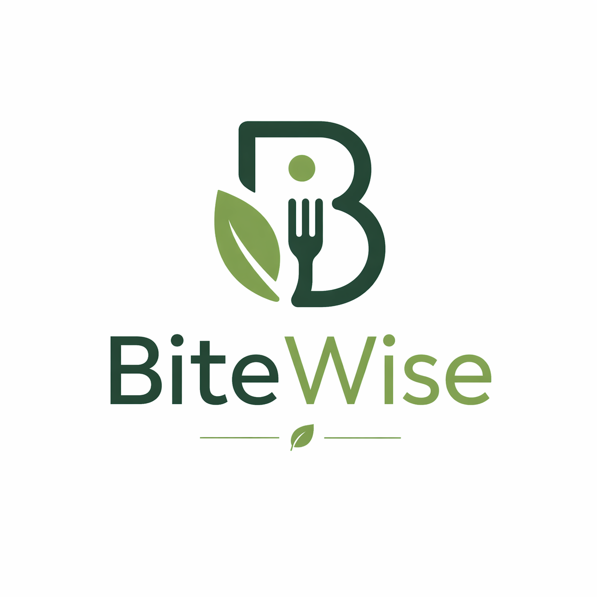

**Typography**

Para el diseño de BiteWise, hemos seleccionado dos fuentes sans serif complementarias: Roboto (utilizando únicamente Bold y Semibold) y Poppins (en Regular, Medium, Semibold y Bold).
Esta combinación garantiza claridad y accesibilidad: Roboto proporciona solidez y prominencia para los elementos principales; Poppins, con sus formas suaves, facilita la lectura fluida de textos extensos y componentes de la interfaz.
Decisiones de diseño  
Roboto (Bold / Semibold)
 Reservado para el logotipo de "BiteWise" y los encabezados principales (como el hero y H1). Su estilo robusto asegura una fuerte presencia visual y legibilidad óptima en tamaños amplios.

Poppins (Regular / Medium / Semibold / Bold)
 Empleado en subtítulos, párrafos, botones, etiquetas, campos de entrada y notificaciones del sistema. Su diseño geométrico y amigable refuerza el carácter acogedor de la marca.

**Colors**

La paleta de colores de BiteWise ha sido elegida para transmitir frescura, salud y confianza, inspirada en elementos naturales como frutas y verduras frescas. Se organiza en tres categorías principales:

Paleta principal: Colores que definen la esencia de BiteWise y se aplican en componentes centrales.

Primario (Verde Fresco): var(--primary-color) (tono principal para botones y acentos).
Secundario (Negro): var(--secondary-color) (para texto principal y elementos interactivos).
Terciario (Blanco): var(--tertiary-color) (para texto secundario y detalles sutiles).
Fondo Verde Claro: var(--bg-light) (fondos de secciones para un aspecto aireado).
Fondo Blanco: var(--white) (fondos de tarjetas y áreas principales).

Paleta de Soporte: Colores auxiliares que aportan equilibrio y variedad.

Morado intenso: Para resaltar algun boton.
Azul Claro: Para enlaces y elementos de navegación.

**Spacing**

El espaciado en BiteWise web sigue un sistema modular y predecible que organiza visualmente la información sobre nuestro servicio. Permite una mejor visualización brindando a nuestros usuarios legibilidad y armonía en cada sección.

Espaciado Básico: Utilizamos 8px como unidad base. Todos los espaciados derivan de múltiplos de esta unidad (8px, 16px, 24px, 32px, 48px, 64px).

Margen Interno (Padding): Las secciones principales utilizan padding vertical de 64px y padding horizontal de 32px, creando márgenes de contención que priorizan el contenido sin que se vea estrecho.

Espacio entre Elementos: Las tarjetas de beneficios, planes o recursos se separan por un espacio de 24px. Los elementos dentro de cada tarjeta usan 16px de separación, creando una jerarquía visual clara y facilitando la exploración del contenido.

Line Height del Texto: Los párrafos descriptivos en landing page usan un interlineado de 1.7, para mejorar la legibilidad de los textos largos. Los títulos y subtítulos usan un interlineado de 1.3, concentrando visualmente el mensaje.

**Tono de comunicación**

Bitewise tiene un tono y voz que reflejan ser agradable y cercano ya que se busca que nuestros usuarios confien en la plataforma para seguir el plan saludable. Además de usar un tono profesional para comunicar que la salud es muy importante

Tono: Cercano y confiable, con un toque de optimismo. Queremos que nuestro usuario tenga confianza en nosotros para que sepa que queremos lo mejor para él.

Actitud: Informada y empática. El 80% de nuestro mensaje es tranquilizador y fundamentado, mientras que el 20% es inspirador para que se motive a seguir el plan alimenticio.

Lenguaje: Accesible y directo. Evitamos usar lenguaje coloquial para evitar confundir a nuestros usuarios. Intentamos ser directos para dejar en claro lo que buscamos.

Voz: Experta y motivadora. Buscamos que nuestra solución se vea experta para generar confianza y motivadora para animar a nuestros usuarios a seguir el plan alimenticio

### 4.1.2. Web Style Guidelines.

4.1.2. Web Style Guidelines

Las directrices de estilo web de nuestro proyecto priorizan la claridad, la accesibilidad y la coherencia visual. Buscamos que cada usuario disfrute de una experiencia intuitiva y agradable, alineada con los valores de la plataforma.

1) Layout

Grid adaptable: El contenido se organiza en una cuadrícula flexible que se ajusta a diferentes tamaños de pantalla, manteniendo siempre el orden y la legibilidad.

Encabezado y pie de página: El header permanece visible para facilitar la navegación, mientras que el footer incluye enlaces útiles y datos de contacto.

Tarjetas: Utilizamos tarjetas con esquinas suaves y sombras ligeras para destacar información clave y mejorar la jerarquía visual.

2) Responsive Design

Desktop: La navegación principal y las acciones importantes están siempre accesibles. El contenido se distribuye en varias columnas para aprovechar el espacio.

Tablet: El menú se simplifica y los elementos se reorganizan en dos columnas. Los botones y campos se agrandan para facilitar la interacción táctil.

Mobile: Todo el contenido se adapta a una sola columna, con menús desplegables y botones grandes para una experiencia óptima en dispositivos móviles.

3) Interaction Design

Botones: Los botones son visibles y responden con animaciones suaves al interactuar, facilitando la comprensión de su función.

Formularios: Los formularios son breves y claros, con campos bien separados para evitar errores y mejorar la usabilidad.

4) Images and Icons

Imágenes: Se emplean imágenes optimizadas que transmiten confianza y cercanía, reforzando el mensaje de la plataforma.

Íconos: Los íconos son simples y consistentes, ayudando a identificar rápidamente funciones y secciones.

5) Organización de Recursos

Estructura: Los archivos de estilos se encuentran en assets/styles, los scripts en assets/js y los recursos gráficos en assets/img. Esta organización facilita el mantenimiento y la colaboración.

Control de versiones: Se utiliza Git para gestionar los cambios y asegurar que todos los miembros trabajen sobre la última versión del proyecto.

## 4.2. Information Architecture. 

La arquitectura de BiteWise fue diseñada para facilitar la búsqueda de informacion que necesiten nuestros usuarios de forma intuitiva y sin ser invasiva.

### 4.2.1. Organization Systems. 

**Jerarquia**

Brindamos la información de forma escalonada. Primero mostramos lo general y luego se dirigen a lo más específico. Iniciamos mostrando un boton de Plan, luego se elige si quieres crear alguno o revisar el que ya tenia, y finalmente crea un plan alimenticio donde podrá visualizarlo e interactuar con él.

**Secciones principales**

- Plan: Elaborar un plan o revisarlo
- Cuenta: Modifica la cuenta
- Añadir Nutricionista: Vincula un nutricionista con el cliente
- Recetas: Para revisar y aprender recetas
- Preferencias: Añade las preferencias del usuario
- Nutricionista: El usuario chatea con un nutricionista
- Noticias: Para buscar noticias actuales o guardadas
- Estudios: Para hallar estudios de nutrición previos

### 4.2.2. Labeling Systems. 

**Nomenclatura**
Las etiquetas tienen nombre que facilitan al usuario lo que esperaria que hagan, como un boton que dice planes, recetas o log in

**Consistencia**
Cuando el usuario es redirigido a traves de una etiqueta tambien se pondra ese nombre de la etiqueta en el título para facilitar la comprensión al usuario.

### 4.2.3. SEO Tags and Meta Tags 

El head usará las etiquetas title y meta, los cuales facilitará entender que hace esa sección. Además, en los Meta Tags se hará uso de descripción, keywords y autor.

### 4.2.4. Searching Systems.

- Barra de Búsqueda: En algunas secciones es importante la barra de busqueda, como ejemplo sería buscar recetas o noticias

- Filtros: Existen filtros para mostrar lo que le interesa al usuario ya sea información actual, favoritos o populares

### 4.2.5. Navigation Systems. 

- Header: El header usa enlaces que le facilitarán la navegación al usuario

- Botones: Varios botones tienen etiquetas que redigiran al usuario a donde desee

- Footer: Tiene algunos enlaces hacia las politicas de privacidad y el termino de condiciones

## 4.3. Landing Page UI Design. 

La interfaz de usuario es vital para que nuestros usuarios pueden navegar libremente por nuestra landing page. Buscamos tratar de guiar a nuestros usuarios de manera fluida ayudandoles a encontrar lo que buscan.

### 4.3.1. Landing Page Wireframe. 

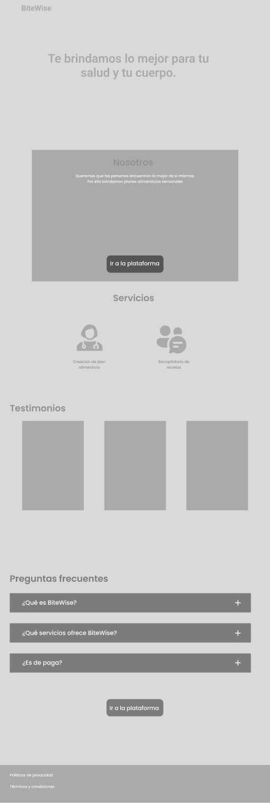

### 4.3.2. Landing Page Mock-up. 

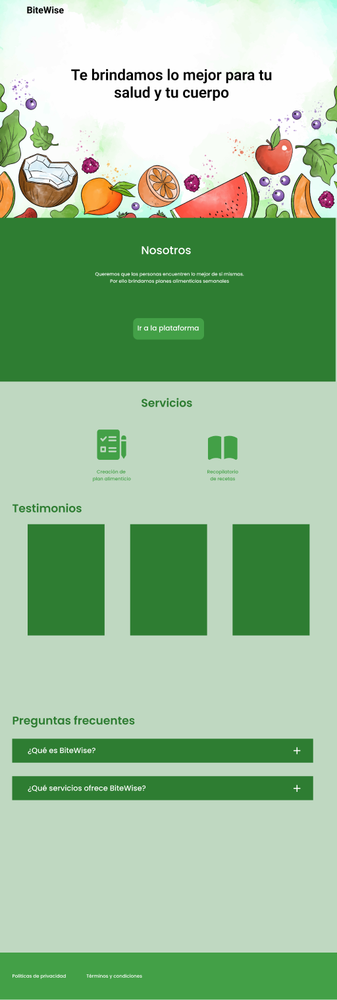

## 4.4. Web Applications UX/UI Design. 
### 4.4.1. Web Applications Wireframes.

Estos wireframes muestra la sección del registro donde primero se pide que los usuarios escogan a que grupo pertenecen para posteriormente registrar sus datos y poder validar su cuenta por correo

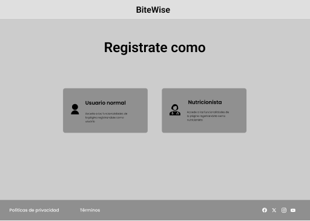

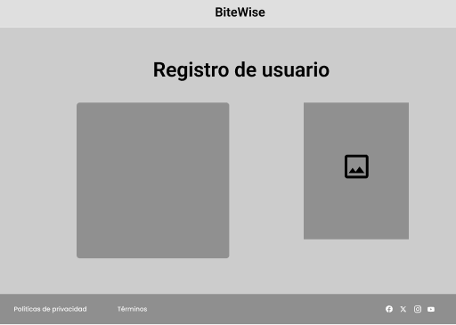

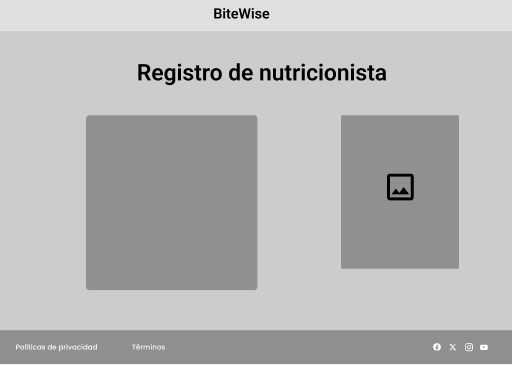

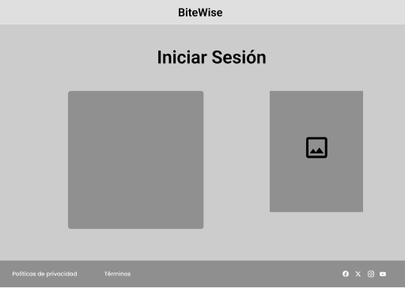

Aqui se muestra la pantalla principal de los usuarios

En las siguientes secciones se puede agregar un plan o revisar el que ya generaste

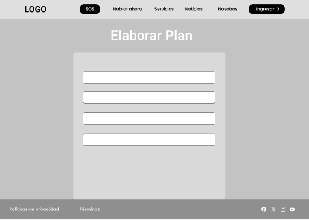

En esta sección se puede ajustar tu perfil y agregar a un nutricionista

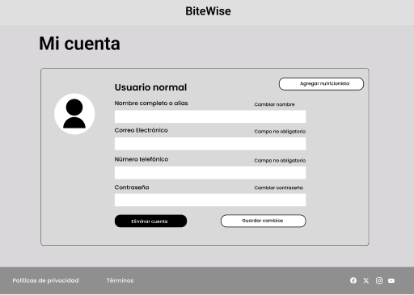

### 4.4.2. Web Applications Wireflow Diagrams. 

Los WireFlows son importantes ya que permiten visualizar el camino que podrian tomar nuestros usuarios para conseguir lo que necesitan

Link de los wireframes: https://www.figma.com/design/rLbsWVnKmH4n2t5SeEmAi1/BiteWise?node-id=1-301&t=zegqYE4dnSC9NWNK-1

### 4.4.2. Web Applications Mock-ups.

En esta sección se muestran los mock-ups de BiteWise

Primero esta el apartado del registro de los usuarios

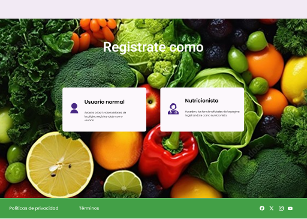

En esta sección esta la pantalla principal donde se puede acceder a distintas secciones

Aqui se puede elaborar los planes alimenticios

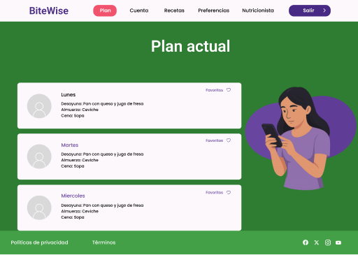

En esta seccion se puede revisar los datos de la cuenta y registrar un nutricionista

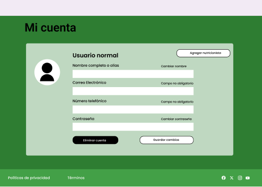

Link de los mock-ups: https://www.figma.com/design/rLbsWVnKmH4n2t5SeEmAi1/BiteWise?node-id=1-301&t=zegqYE4dnSC9NWNK-1

### 4.4.3. Web Applications User Flow Diagrams. 

La aplicación web pedirá que nos registremos en caso de no tener una cuenta. En caso de que tengamos podemos pasar al login.

En la pantalla principal podemos dirigirnos a distintas secciones como crear un plan, buscar recetas, configurar las preferencias entre otros.

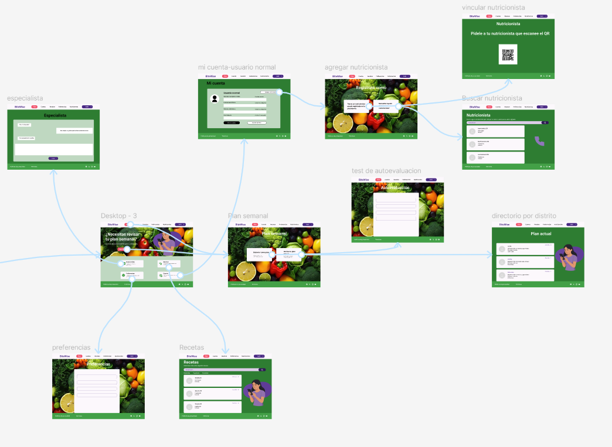

## 4.5. Web Applications Prototyping. 

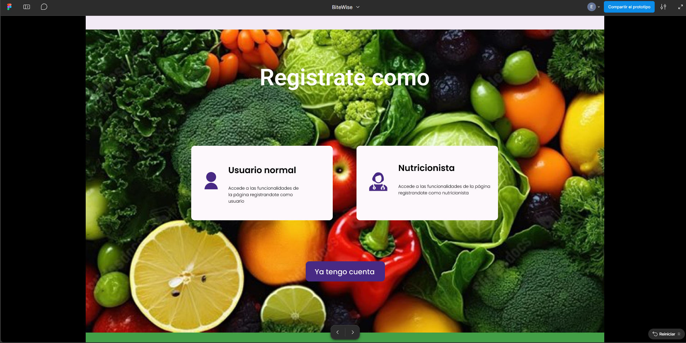

Video del prototype: https://youtu.be/25lDz-SpG9I

## 4.6. Domain-Driven Software Architecture. 

La arquitectura de software de BiteWise iniciara desde a un análisis realizado mediante Big Picture Event Storming, la cual nos permitirá identificar los procesos más importantes del dominio, así como las interacciones entre los distintos actores involucrados, principalmente usuarios y nutricionistas.

Sobre esta base, se procedió a estructurar el dominio aplicando los principios de Domain-Driven Design (DDD), con el objetivo de establecer una organización clara y una adecuada separación de contextos dentro del sistema.

### 4.6.1. Design-Level Event Storming. 

En este apartado se identificarán los dominios de nuestro negocio haciendo uso de la técnica Event Storming

1. Bounded Context Authentication

2. Bounded Context Profile

3. Bounded Context Plan

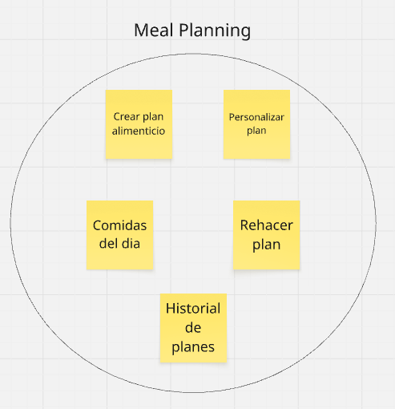

4. Bounded Context Recipe

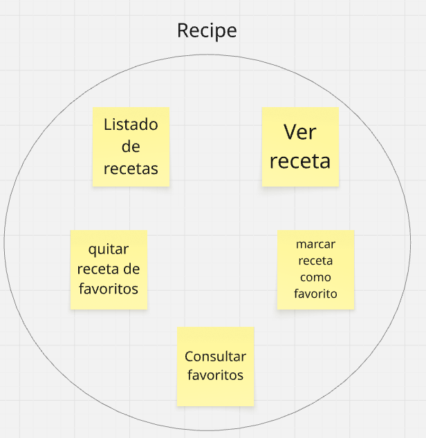

5. Bounded Context Comunication

6. Bounded Context Premium

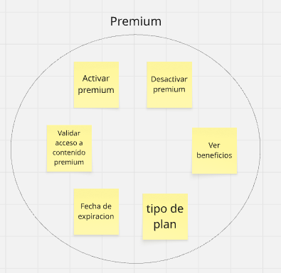

7. Bounded Context Payment

### 4.6.2. Software Architecture Context Diagram. 

### 4.6.3. Software Architecture Container Diagrams. 

### 4.6.4. Software Architecture Components Diagrams. 

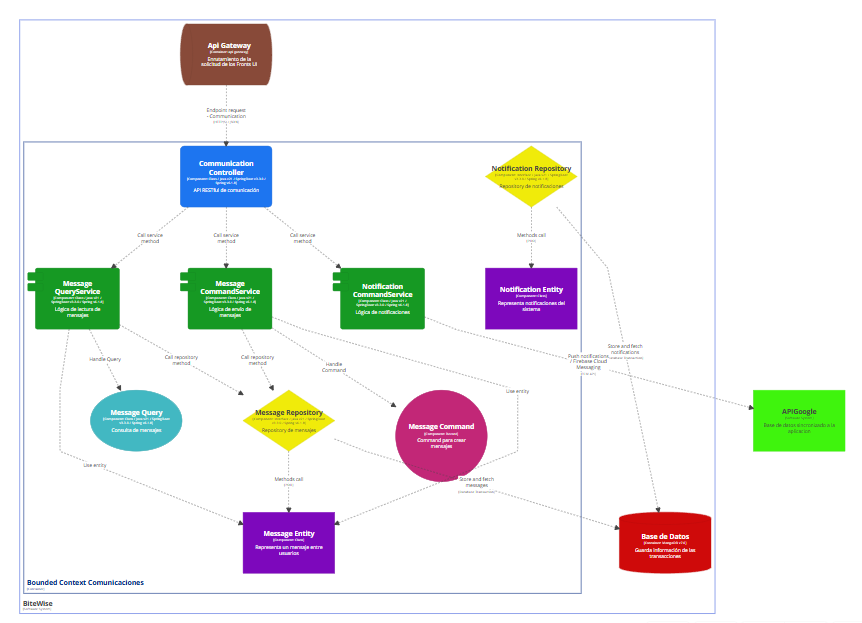

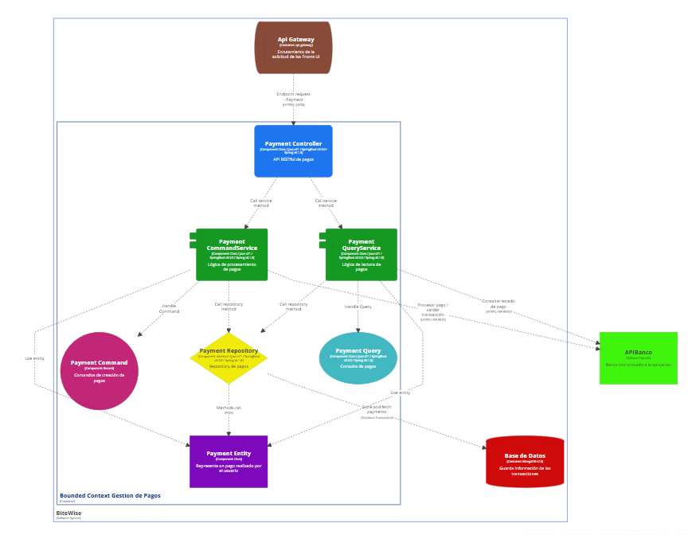

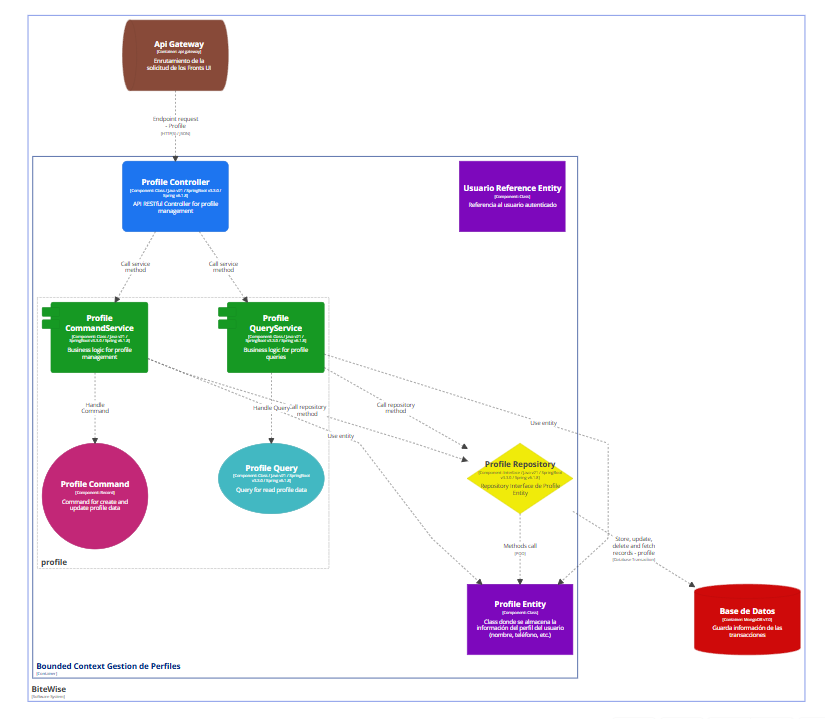

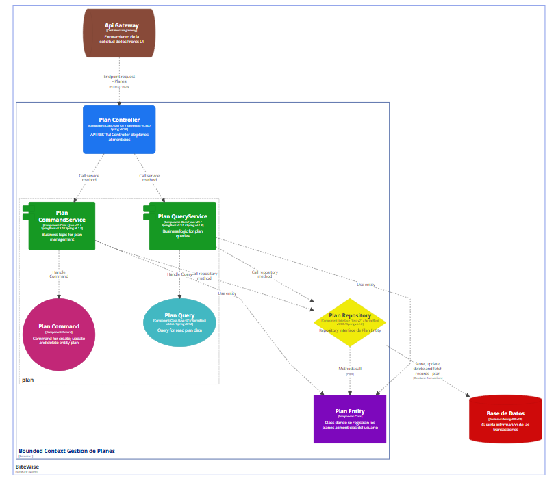

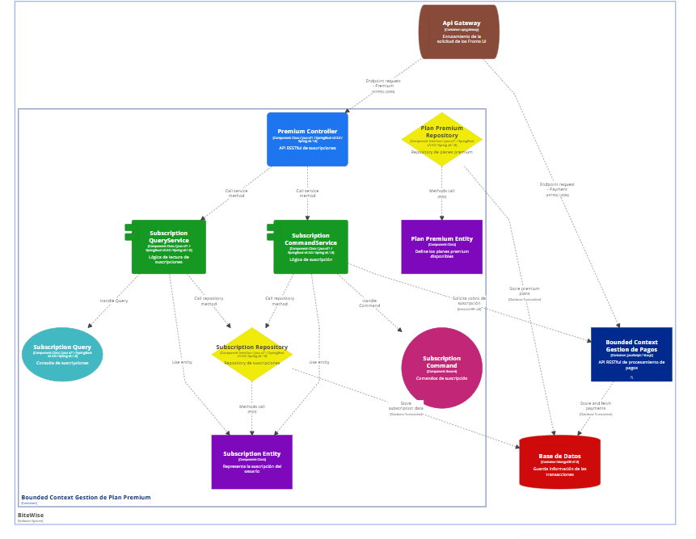

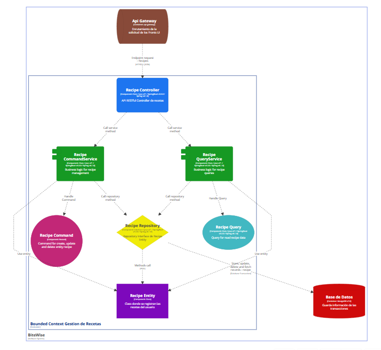

## 4.7. Software Object-Oriented Design. 
### 4.7.1. Class Diagrams. 
## 4.8. Database Design. 
### 4.8.1. Database Diagrams.