<p align="center">
    
</p>

<h1 align="center">
    Universidad Peruana de Ciencias Aplicadas
</h1>

<h3 align="center">
    Carrera: Ingeniería de Software
    <br> <br>
    Curso: SI729 - Desarrollo de Aplicaciones Open Source
    <br> <br>
    Sección: 11913
    <br> <br>
    Profesor: Juan Antonio Flores Moroco
    <br> <br>
    Ciclo: 2026-01 
    <br> <br>
    Informe de Trabajo Final
    <br> <br>
    Startup: BiteWise
    <br> <br>
    Producto:   
</h3>

<div align="center">

| <div style="width:300px">Alumno</div>       | <div style="width:125px">Código</div> |
|:-------------------------------------------:|:-------------------------------------:|
|  Hermoza Quispe, Jude Alessandro           |              u202318220               |
|       Flores Siguas, Marlon Alessandro           |              u202415412               |
| Munayco Apolaya, Maria Luisa   |              u20231c995               |
|       Verastigue Martinez, Giancarlo Jose           |              U202419483               |
|           Mantilla Maldonado, Enrique Manuel  |              u20231b842               |

</div>

<div align="center"> Abril 2025 </div>


<hr>

## Registro de Versiones del Informe

| Versión | Fecha | Autor(es) | Descripción de modificación |
|---------|-------|-----------|-----------------------------|
| 0.1 | 19/04/2026 | Enrique Mantilla Maldonado | Initial commit. |
| 0.2 | 21/04/2026 | Jude Hermoza Quispe | Actualización de miembros del equipo, student outcomes y perfiles personales. |
| 0.3 | 22/04/2026 | Maria Munayco Apolaya, Giancarlo Verastigue Martinez | Revisión de introducción personal; subida de archivos; actualización del README; adición de capítulos 5.1.1 y 5.1.2. |
| 0.4 | 23/04/2026 | Maria Munayco Apolaya | Actualización del README con style guide y detalles de despliegue. |
| 0.5 | 24/04/2026 | Maria Munayco Apolaya, Giancarlo Verastigue Martinez, Enrique Mantilla Maldonado | Adición de enlaces de Figma y landing page en el README; adición de capítulos 3 y 4. |
| 0.6 | 25/04/2026 | Enrique Mantilla Maldonado, Giancarlo Verastigue Martinez, Maria Munayco Apolaya | Múltiples updates: merges; actualización de capítulos 2.4, 3.3 y 5 (incluyendo detalles de Sprint 1, Sprint 2 y subsección 5.2); conclusiones de student outcome; reemplazo de imágenes en landing page y enlaces a Structurizr; arreglo general de diagramas. |

## Project Report Collaboration Insights  

Todas las actividades asignadas para la entrega de la TB1 han sido completadas y se encuentran documentadas en el repositorio de GitHub de la organización del equipo, accesible en: https://github.com/BiteWise-Grupo-OpenSource. En cuanto al informe, cada miembro del equipo participó redactando y elaborando gráficos en formato Markdown de acuerdo con los temas asignados, registrando su progreso mediante commits en el repositorio correspondiente, encontrándose en el siguiente enlace: https://github.com/BiteWise-Grupo-OpenSource/Startup-Docs
Aqui se pueden aprecion todos los commits hechos en la TB1 evidenciando el trabajo colaborativo.

**Insights Readme**
<p align="center">
    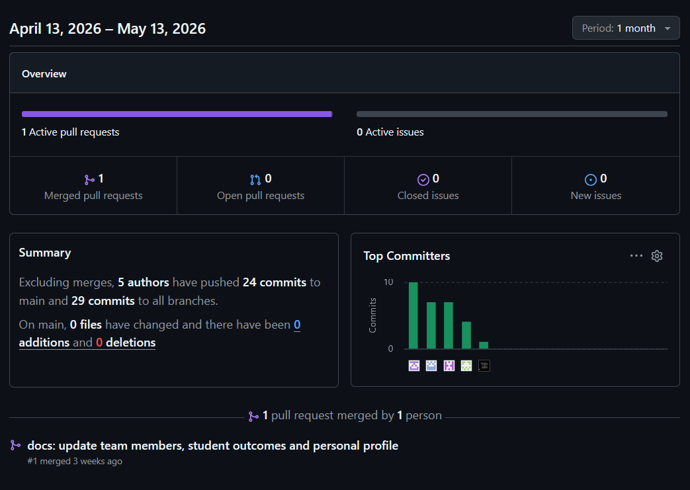
</p>

## Tabla de Contenidos

Capítulo I: Introducción    
        <ul>
            <li><a href="#11-Startup-Profile">1.1. Startup Profile</a></li>
            <li><a href="#111-Descripción-de-la-Startup">1.1.1. Descripción de la Startup</a></li>
            <li><a href="#112-Perfiles-de-Integrantes-del-Equipo">1.1.2. Perfiles de Integrantes del Equipo</a></li>
            <li><a href="#12-Solution-Profile">1.2. Solution Profile</a></li>
            <li><a href="#121-Antecedentes-y-Problemática">1.2.1. Antecedentes y Problemática</a></li>
            <li><a href="#122-Lean-UX-Process">1.2.2. Lean UX Process</a></li>
            <li><a href="#1221-Lean-UX-Problem-Statements">1.2.2.1. Lean UX Problem Statements</a></li>
            <li><a href="#1222-Lean-UX-Assumptions">1.2.2.2. Lean UX Assumptions</a></li>
            <li><a href="#1223-Lean-UX-Hypothesis-Statements">1.2.2.3. Lean UX Hypothesis Statements</a></li>
            <li><a href="#1224-Lean-UX-Canvas">1.2.2.4. Lean UX Canvas</a></li>
            <li><a href="#13-Segmentos-Objetivos">1.3. Segmentos Objetivos</a></li>
        </ul>    
        
Capítulo II: Requirements Elicitation & Analysis
        <ul>
            <li><a href="#21-competidores">2.1. Competidores</a></li>
            <li><a href="#211-Análisis-competitivo">2.1.1. Análisis competitivo</a></li>
            <li><a href="#212-Estrategias-y-tácticas-frente-a-competidores">2.1.2. Estrategias y tácticas frente a competidores</a></li>
            <li><a href="#22-Entrevistas">2.2. Entrevistas</a></li>
            <li><a href="#221-Diseño-de-entrevistas">2.2.1. Diseño de entrevistas</a></li>
            <li><a href="#222-Registro-de-entrevistas">2.2.2. Registro de entrevistas</a></li>
            <li><a href="#223-Análisis-de-entrevistas">2.2.3. Análisis de entrevistas</a></li>
            <li><a href="#23-Needfinding">2.3. Needfinding</a></li>
            <li><a href="#231-User-Personas">2.3.1. User Personas</a></li>
            <li><a href="#232-User-Task-Matrix">2.3.2. User Task Matrix</a></li>
            <li><a href="#233-User-Journey-Mapping">2.3.3. User Journey Mapping</a></li>
            <li><a href="#234-Empathy-Mapping">2.3.4. Empathy Mapping</a></li>
            <li><a href="#235-As-is-Scenario-Mapping">2.3.5. As-is Scenario Mapping</a></li>
            <li><a href="#24-Ubiquitous-Language">2.4. Ubiquitous Language</a></li>
        </ul>   

Capítulo III: Requirements Specification 
        <ul>
            <li><a href="#31-To-Be-Scenario-Mapping">3.1. To-Be Scenario Mapping</a></li>
            <li><a href="#32-User-Stories">3.2. User Stories</a></li>
            <li><a href="#33-Impact-Mapping">3.3. Impact Mapping</a></li>
            <li><a href="#34-Product-Backlog">3.4. Product Backlog</a></li>
        </ul>    
        
Capítulo IV: Product Design
        <ul>
            <li><a href="#41-Style-Guidelines">4.1. Style Guidelines</a></li>
            <li><a href="#411-General-Style-Guidelines">4.1.1. General Style Guidelines</a></li>
            <li><a href="#412-Web-Style-Guidelines">4.1.2. Web Style Guidelines</a></li>
            <li><a href="#42-Information-Architecture">4.2. Information Architecture</a></li>
            <li><a href="#421-Organization-Systems">4.2.1. Organization Systems</a></li>
            <li><a href="#422-Labeling-Systems">4.2.2. Labeling Systems</a></li>
            <li><a href="#423-SEO-Tags-and-Meta-Tags">4.2.3. SEO Tags and Meta Tags</a></li>
            <li><a href="#424-Searching-Systems">4.2.4. Searching Systems</a></li>
            <li><a href="#425-Navigation-Systems">4.2.5. Navigation Systems</a></li>
            <li><a href="#43-Landing-Page-UI-Design">4.3. Landing Page UI Design</a></li>
            <li><a href="#431-Landing-Page-Wireframe">4.3.1. Landing Page Wireframe</a></li>
            <li><a href="#432-Landing-Page-Mock-up">4.3.2. Landing Page Mock-up</a></li>
            <li><a href="#44-Web-Applications-UXUI-Design">4.4. Web Applications UX/UI Design</a></li>
            <li><a href="#441-Web-Applications-Wireframes">4.4.1. Web Applications Wireframes</a></li>
            <li><a href="#442-Web-Applications-Wireflow-Diagrams">4.4.2. Web Applications Wireflow Diagrams</a></li>
            <li><a href="#443-Web-Applications-Mock-ups">4.4.3. Web Applications Mock-ups</a></li>
            <li><a href="#444-Web-Applications-User-Flow-Diagrams">4.4.4. Web Applications User Flow Diagrams</a></li>
            <li><a href="#45-Web-Applications-Prototyping">4.5. Web Applications Prototyping</a></li>
            <li><a href="#46-Domain-Driven-Software-Architecture">4.6. Domain-Driven Software Architecture</a></li>
            <li><a href="#461-Software-Architecture-Context-Diagrams">4.6.1. Software Architecture Context Diagrams</a></li>
            <li><a href="#462-Software-Architecture-Container-Diagrams">4.6.2. Software Architecture Container Diagrams</a></li>
            <li><a href="#463-Software-Architecture-Components-Diagrams">4.6.3. Software Architecture Components Diagrams</a></li>
            <li><a href="#47-Software-Object-Oriented-Design">4.7. Software Object-Oriented Design</a></li>
            <li><a href="#471-Class-Diagrams">4.7.1. Class Diagrams</a></li>
            <li><a href="#472-Class-Dictionary">4.7.2. Class Dictionary</a></li>
            <li><a href="#48-Database-Design">4.8. Database Design</a></li>
            <li><a href="#481-Database-Diagram">4.8.1. Database Diagram</a></li>
        </ul>    


Capítulo V: Product Implementation, Validation & Deployment 
        <ul>
            <li><a href="#51-software-configuration-management">5.1. Software Configuration Management</a></li>
            <li><a href="#511-software-development-environment-configuration">5.1.1. Software Development Environment Configuration</a></li>
            <li><a href="#512-source-code-management">5.1.2. Source Code Management</a></li>
            <li><a href="#513-source-code-style-guide-conventions">5.1.3. Source Code Style Guide & Conventions</a></li>
            <li><a href="#514-software-deployment-configuration">5.1.4. Software Deployment Configuration</a></li>
            <li><a href="#52-landing-page-services-applications-implementation">5.2. Landing Page, Services & Applications Implementation</a></li>
            <li><a href="#521-sprint-1">5.2.1. Sprint 1</a></li>
            <li><a href="#5211-sprint-planning-1">5.2.1.1. Sprint Planning 1</a></li>
            <li><a href="#5212-aspect-leaders-and-collaborators">5.2.1.2. Aspect Leaders and Collaborators</a></li>
            <li><a href="#5213-sprint-backlog-1">5.2.1.3. Sprint Backlog 1</a></li>
            <li><a href="#5214-development-evidence-for-sprint-review">5.2.1.4. Development Evidence for Sprint Review</a></li>
            <li><a href="#5215-execution-evidence-for-sprint-review">5.2.1.5. Execution Evidence for Sprint Review</a></li>
            <li><a href="#5216-services-documentation-evidence-for-sprint-review">5.2.1.6. Services Documentation Evidence for Sprint Review</a></li>
            <li><a href="#5217-software-deployment-evidence-for-sprint-review">5.2.1.7. Software Deployment Evidence for Sprint Review</a></li>
            <li><a href="#5218-team-collaboration-insights-during-sprint">5.2.1.8. Team Collaboration Insights during Sprint</a></li>
        </ul>        


<hr>

## Student Outcome

El curso contribuye al cumplimiento del Student Outcome ABET:

**ABET – EAC - Student Outcome 3**

Criterio: Capacidad de comunicarse efectivamente con un rango de audiencias. 
En el siguiente cuadro se describe las acciones realizadas y enunciados de conclusiones por parte del grupo,
que permiten sustentar el haber alcanzado el logro del ABET – EAC - Student Outcome 3.

| Criterio específico | Acciones Realizadas | Conclusiones |
|---------------------|---------------------|--------------|
| Comunica oralmente con efectividad a diferentes rangos de audiencia | **Jude Hermoza TB1:** Capítulo 1: Introducción; Capítulo II: Requirements Elicitation & Analysis.<br><br>**Marlon Flores TB1:** Por definir.<br><br>**Maria Munayco TB1:** Sprint 1; Sprint Planning 1; Software Deployment Configuration; Landing Page; Services & Applications Implementation.<br><br>**Giancarlo Verastigue TB1:**  5.1. Software Configuration Management, 5.1.2. Source Code Management.<br><br>**Enrique Mantilla TB1:** Capítulo III: Requirements Specification; Capítulo IV: Product Design. | **TB1:** Consideramos que la comunicación oral fue aplicada de forma clara, permitiendo exponer hallazgos, transmitir insights y sostener discusiones de forma efectiva. Gracias a ello, se alcanzó una comprensión común del problema y se sentaron bases sólidas para proponer soluciones innovadoras.<br><br>**TP:** Por redactar.<br><br>**TB2:** Por redactar.<br><br>**TF:** Por redactar. |
| Comunica por escrito con efectividad a diferentes rangos de audiencia | **Jude Hermoza TB1:** Capítulo 1: Introducción; Capítulo II: Requirements Elicitation & Analysis.<br><br>**Marlon Flores TB1:** Por definir.<br><br>**Maria Munayco TB1:** Sprint 1; Sprint Planning 1; Software Deployment Configuration; Landing Page; Services & Applications Implementation.<br><br>**Giancarlo Verastigue TB1:** 5.1. Software Configuration Management, 5.1.2. Source Code Management.<br><br>**Enrique Mantilla TB1:** Capítulo III: Requirements Specification; Capítulo IV: Product Design.  | **TB1:** La comunicación escrita se realizó de manera transparente, permitiendo un mejor entendimiento entre nosotros. Esto permitió documentar hallazgos, explicar la problemática y presentar propuestas de manera efectiva, logrando que toda la información fuera comprendida y validada.<br><br>**TP:** Por redactar.<br><br>**TB2:** Por redactar.<br><br>**TF:** Por redactar. |


<hr>

## Capítulo I: Introducción 

### 1.1. Startup Profile
Somos un equipo de estudiantes de la Universidad Peruana de Ciencias Aplicadas (UPC) motivados en desarrollar una solución diferente que cuyo objetivo principal sea ayudar a las personas a generar planes de comida personalizados basados en sus preferencias, objetivos de salud y necesidades nutricionales. 

#### 1.1.1. Descripción de la Startup
Nuestra startup, BiteWise nace de la necesidad existente de mantener una salud a través de la alimentación y de esta manera facilitar la creación de planes de comida adaptados a las necesidades específicas de cada persona. Ya sea para quienes buscan alcanzar objetivos de salud, mejorar su nutrición o gestionar dietas con restricciones alimenticias usando excepciones y restricciones específicas. Nosotros como BiteWise garantizamos una interfaz amigable y herramientas eficientes, dando una experiencia sencilla y accesible para todos los usuarios.

**Misión:** Ofrecer a nuestros usuarios una herramienta accesible y eficiente para mejorar su bienestar a través de la alimentación personalizada, ayudándoles a alcanzar sus metas de salud y nutrición con facilidad y precisión.

**Visión:** Convertirnos en la plataforma líder en soluciones de planificación de alimentos personalizados, proporcionando a millones de usuarios la oportunidad de tomar decisiones alimenticias informadas y alineadas con sus objetivos de salud a nivel global.

#### 1.1.2. Perfiles de Integrantes del Equipo

- Jude Alessandro Hermoza Quispe - u202318220 (Ingeniería de Software)

<p align="center">
    
</p>

Me considero una persona proactiva y comprometida con mi formación profesional en Ingeniería de Software. Me apasiona el desarrollo de soluciones tecnológicas innovadoras y disfruto trabajar en equipo, aportando ideas creativas y manteniendo una comunicación efectiva para alcanzar los objetivos del proyecto de manera eficiente y responsable.

- Marlon Alessandro Flores Siguas - u202415412 (Ingeniería de Software)

<p align="center">
    
</p>

[Añadir descripción personal aquí]

- Maria Luisa Munayco Apolaya - u20231c995 (Ingeniería de Software)

<p align="center">
    
</p>

Soy estudiante de la carrera de Ingeniería de Software en la Universidad Peruana de Ciencias Aplicadas (UPC). Tengo 19 años. Cuento con conocimientos en lenguajes de programación como Python, JavaScript, Unity y C++. 
Me considero una persona perseverante, organizada y curiosa, ya que siempre busco aprender cosas nuevas y mejorar mis habilidades en el área tecnológica.


- Giancarlo Jose Verastigue Martinez - u202419483 (Ingeniería de Software)

<p align="center">
    
</p>

Mi nombre es Giancarlo Jose Verastigue Martinez, estudiante de Ingeniería de Software. Soy una persona responsable y enfocada en sus proyectos y metas, a nivel académico cuento con conocimientos en programación en el lenguaje de C++, con experiencia trabajando en equipo y bajo presión. Considero que soy organizado y detallista en mis proyectos. La experiencia laboral y la universidad me han hecho desarrollar habilidades para afrontar problemas o dificultades de manera exitosa, habilidades que aportaré a este grupo de trabajo y de esta manera sacar adelante nuestro proyecto.

- Enrique Manuel Mantilla Maldonado - u20231b842 (Ingeniería de Software)

<p align="center">
    
</p>

Soy un estudiante de la Universidad Peruana de Ciencias Aplicadas (UPC). Actualmente estoy llevando la carrera de Ingeniería de Software. Manejo el lenguaje python y C++.
Busco retarme a mi mismo y tambien busco aprender todo lo que vea a mi alrededor para poder aplicarlo en el futuro.

### 1.2. Solution Profile
BiteWise es una plataforma web que permite a los usuarios crear planes de comida de manera personalizada basados en sus preferencias, objetivos de salud, restricciones médicas y necesidades nutricionales: Esto se da mediante un perfil propio, pues la aplicación adapta las recomendaciones alimenticias a restricciones y excepciones, brindando una experiencia diferente. Además, incluye herramientas de seguimiento y análisis que permiten ajustar los planes según los avances y metas del usuario. Con un modelo freemium, la versión básica ofrece funcionalidades esenciales de personalización, mientras que las opciones premium brindan acceso a características avanzadas como análisis nutricionales detallados. BiteWise se posiciona como una solución integral para aquellos que buscan mejorar su bienestar a través de una alimentación controlada y alineada con sus objetivos de salud.

#### 1.2.1. Antecedentes y problemática
**What**  
- El problema radica en que las herramientas actuales de planificación de comidas generan planes genéricos que no contemplan las condiciones de salud, las preferencias personales ni el contexto de vida de cada usuario, lo cual desemboca en una baja adherencia, frustración y eventual abandono de los hábitos saludables. 

**When**  
 
- La falta de personalización es un reto constante, pero se intensifica en momentos clave: tras un diagnóstico médico (por ejemplo, diabetes o hipertensión), al iniciar procesos de pérdida o ganancia de peso, y especialmente posterior a la pandemia, cuando la demanda de soluciones remotas de autocuidado y seguimiento nutricional creció significativamente.

**Where**  

- Este problema emerge en la rutina diaria de las personas: al planificar la lista de compras, cuando cocinan en casa o durante las consultas nutricionales. Asimismo, se siente con fuerza en los entornos clínicos, donde los profesionales deben adaptar dietas sin un sistema que integre datos en tiempo real ni las preferencias culturales o económicas de sus pacientes..  

¿Dónde surge el problema?  
- En la rutina cotidiana de cada persona: al cocinar, hacer la compra o acudir a citas médicas, se percibe la falta de una guía clara y ajustada a necesidades cambiantes.  

**Who**  
- Se ven afectados principalmente dos grupos: por un lado, los usuarios finales, que pueden ser personas con objetivos de salud (pérdida de peso, ganancia muscular, mejora del rendimiento) o con restricciones médicas (diabetes, hipertensión, alergias e intolerancias); y, por otro, los profesionales de la salud (nutriólogos, dietistas y médicos), quienes carecen de una herramienta ágil y versátil para diseñar y monitorear dietas realmente personalizadas. 

**Why**  

- Este problema existe porque las aplicaciones actuales se basan en plantillas estándar, no adaptan las porciones ni consideren comorbilidades; además, adolecen de una integración de datos biométricos (peso, talla, exámenes clínicos) y de un registro real de los hábitos y preferencias de cada usuario, y sólo usan de manera limitada algoritmos que puedan ajustar automáticamente los menús conforme cambian las necesidades. 

**How**  

- Los usuarios terminan empleando sistemas rígidos que generan menús inadecuados, lo que desincentiva el seguimiento sostenido. Por su parte, los profesionales de la salud deben recurrir a hojas de cálculo o notas manuales, careciendo de un flujo de información automatizado que facilite la actualización de los planes de alimentación según la evolución de sus pacientes..  

**How much**  
- En el Perú, el exceso de peso es un problema de salud pública de gran magnitud: según la Encuesta Demográfica y de Salud Familiar ENDES 2021, el 62.7 % de las personas de 15 años o más presentan exceso de peso, de las cuales el 36.9 % tiene sobrepeso y el 25.8 % obesidad, lo que equivale a aproximadamente 15 millones de peruanos afectados

#### 1.2.2. Lean UX Process

#### 1.2.2.1. Lean UX Problem Statements
Los usuarios con metas de salud y restricciones dietéticas, así como los profesionales de la salud encargados de diseñar y monitorear dietas individualizadas, enfrentan dificultades para encontrar y gestionar planes de alimentación que realmente se ajusten a sus necesidades específicas.

Hemos observado que muchos de estos usuarios sienten que los planes ofrecidos no consideran sus condiciones médicas (diabetes, hipertensión, alergias e intolerancias), sus preferencias culturales o su contexto económico, lo cual provoca baja adherencia al seguimiento, reducción en la frecuencia de uso de la plataforma y, finalmente, un impacto negativo en su estado de salud.

¿Cómo podríamos enfocar los planes alimenticios para mejorar la adherencia de los usuarios y sostener hábitos saludables a largo plazo?

#### 1.2.2.2. Lean UX Assumptions

**Assumptions Worksheet**

### Supuestos del Negocio – BiteWise

1. **Creo que mis clientes tienen la necesidad de:**  
   Contar con planes de alimentación realmente personalizados que consideren sus objetivos de salud, preferencias, restricciones médicas, contexto cultural y estilo de vida, para mejorar su bienestar y adherencia a hábitos saludables.

2. **Estas necesidades pueden resolverse con:**  
   BiteWise, una plataforma web inteligente y amigable que genera, adapta y hace seguimiento de planes de comida personalizados, integrando datos biométricos, preferencias y restricciones, y ofreciendo análisis y recordatorios.

3. **Mis clientes iniciales son (o serán):**  
   - Usuarios finales: Jóvenes y adultos peruanos que quieren adquirir hábitos saludables, bajar de peso, ganar masa muscular o controlar condiciones médicas (diabetes, hipertensión, alergias e intolerancias).  
   - Profesionales de la salud: Nutricionistas, dietistas y médicos que necesitan herramientas digitales para diseñar, monitorear y ajustar dietas de forma más eficiente.

4. **El principal valor que un cliente quiere obtener de mi servicio es:**  
   Personalización real de su dieta diaria según sus metas, gustos y restricciones.  
   **También pueden obtener estos beneficios adicionales:**  
   Educación alimentaria, ahorro de tiempo en la planificación, recordatorios, recomendaciones de recetas y seguimiento de progreso.

5. **Adquiriré la mayoría de mis clientes a través de:**  
   - Marketing digital en redes sociales (contenido educativo, tips de nutrición).  
   - Alianzas y recomendaciones de profesionales de la salud (consultorios, clínicas).  
   - Colaboraciones con influencers del ámbito fitness y bienestar.

6. **Ganaré dinero mediante:**  
   - Modelo freemium: acceso gratuito a funciones básicas.  
   - Suscripciones mensuales premium para acceso a análisis detallados, integración de datos biométricos y funciones avanzadas.  
   - Alianzas con centros de salud y nutricionistas (paquetes institucionales).

7. **Mi principal competencia en el mercado será:**  
   Otras apps de nutrición o control de calorías genéricas, plantillas de dietas en línea y métodos tradicionales de consulta.  
   **Superaremos a la competencia debido a:**  
   Nuestro enfoque en personalización profunda, adaptada al contexto local peruano, y a la integración de datos clínicos y preferencias culturales.

8. **El mayor riesgo de mi producto es:**  
   Que los usuarios no perciban la plataforma como suficientemente diferenciada o no logren adherirse al plan.  
   **Lo resolveremos mediante:**  
   Actualizaciones continuas del algoritmo, test A/B, encuestas de satisfacción y canal de feedback directo.

9. **Otras suposiciones que, si se demuestran falsas, harán que nuestro negocio fracase:**  
   - Que los usuarios estén dispuestos a pagar por planes personalizados.  
   - Que los profesionales de la salud adopten herramientas digitales en su práctica.  
   - Que la cultura local valore (y pague por) soluciones tecnológicas de nutrición.


### Supuestos del Cliente – BiteWise

1. **¿Quién es el cliente?**  
   Personas peruanas (jóvenes y adultos) interesadas en mejorar su alimentación y salud—incluyendo quienes buscan bajar de peso, ganar masa muscular o controlar enfermedades—y profesionales de la salud (nutricionistas, dietistas, médicos).

2. **¿Dónde encaja nuestro producto en su vida?**  
   En su rutina diaria: al comenzar el día para revisar el menú sugerido, al planificar la lista de compras, al cocinar siguiendo recetas del plan, y en las consultas con profesionales para ajustar dietas.

3. **¿Qué problemas soluciona nuestro producto?**  
   - Planes genéricos que no consideran restricciones, preferencias ni comorbilidades.  
   - Baja motivación y adherencia por falta de contexto.  
   - Dificultad para ajustar dietas según el progreso o exámenes clínicos.  
   - Ausencia de una herramienta ágil para profesionales que diseñan dietas.

4. **¿Cuándo y cómo se utiliza nuestro producto?**  
   - Uso diario: revisar plan al iniciar el día, registrar alimentos y progreso.  
   - Semanal o mensual: ajustar objetivos y compras.  
   - Acceso vía navegador en computadora o dispositivo móvil, cuando planifican comidas o ingresan datos biométricos.

5. **¿Qué características son importantes?**  
   - Generación automática de planes personalizados.  
   - Inclusión de objetivos de salud, preferencias y restricciones.  
   - Gestión de excepciones (alergias, intolerancias).  
   - Interfaz sencilla e intuitiva con recordatorios, reportes y recomendaciones de recetas.

6. **¿Cómo debe verse y comportarse nuestro producto?**  
   - Con un diseño moderno, limpio y profesional que transmita confianza.  
   - Responsive, con navegación fluida en distintos dispositivos.  
   - Feedback claro (gráficos de progreso, alertas), y opción de modificar planes con un par de clics.

**Lean & Hypothesis - Driven Development**

#### 1.2.2.3. Lean UX Hypothesis Statements

**1ra Hipótesis**  
**Creemos que** ofrecer planes alimenticios personalizados que se ajusten a objetivos específicos (como bajar de peso o controlar la diabetes) aumentará el compromiso de los usuarios con la plataforma.  
**Sabremos que estamos bien cuando** veamos que los usuarios ingresan y siguen su plan nutricional durante al menos 5 días consecutivos en un período de prueba de dos semanas.

---

**2da Hipótesis**  
**Creemos que** dar opción a los usuarios de modificar ingredientes y platos dentro de sus planes aumentará la probabilidad de adherirse al plan nutricional.  
**Sabremos que esto es cierto cuando** veamos que más del 60% de los usuarios personalizan sus planes y, como resultado, se disminuye la tasa de abandono semanal.

---

**3ra Hipótesis**  
**Creemos que** integrar recordatorios diarios y consejos personalizados aumentará el uso frecuente de la aplicación.  
**Sabremos que estamos teniendo éxito cuando** veamos que el número de sesiones activas por usuario aumente en un 30% en el primer mes tras activar los recordatorios personalizados.

---

**4ta Hipótesis**  
**Creemos que**  ofrecer una experiencia de registro simple y guiada, incluyendo objetivos, restricciones y preferencias alimenticias, mejorará la tasa de finalización del onboarding.  
**Sabremos que estamos teniendo éxito cuando** al menos el 75% de los nuevos usuarios completen el proceso de registro y generen su primer plan en menos de 10 minutos.

---

**5ta Hipótesis**  
**Creemos que**  ofrecer una versión gratuita con funcionalidades básicas incentivará la prueba de la plataforma y facilitará la conversión a planes premium.  
**Sabremos que esto es cierto cuando** al menos el 10% de los usuarios activos en la versión gratuita se conviertan a usuarios premium dentro de los primeros 30 días.

---

**6ta Hipótesis**  
**Creemos que** una interfaz moderna, intuitiva y responsive aumentará la satisfacción del usuario y disminuirá la fricción en el uso diario.  
**Sabremos que esto es cierto cuando** logremos una puntuación promedio de al menos 4/5 en encuestas de experiencia de usuario en el primer mes de uso.

#### 1.2.2.4. Lean UX Canvas
<p align="center">
  
</p>

Visualizar diseño en Canva:https://www.canva.com/design/DAGlJeSBFYU/vHO916op--9i6YxHpOLG8Q/edit?utm_content=DAGlJeSBFYU&utm_campaign=designshare&utm_medium=link2&utm_source=sharebutton

### 1.3. Segmentos Objetivos
### Segmento Objetivo 1: Jóvenes Adultos

#### Aspectos Demográficos:
- **Sexo:** Masculino y Femenino
- **Edades:** Entre 18 y 65 años
- **Nivel Socioeconómico:** Clases A, B, C, D (media alta, media, media-baja, baja)
- **Ocupación:** Estudiantes universitarios, profesionales, emprendedores
- **Ingresos:** Ingresos variables dependiendo de su ocupación, con la posibilidad de tener ingresos fijos o por proyectos

#### Aspectos Geográficos:
- **Nacionalidad:** Nacional (principalmente en áreas urbanas y suburbanas)
- **Ubicación Actual:** Principalmente en grandes ciudades, como Lima, Arequipa, Trujillo, Piura
- **Acceso a Tecnología:** Alta disponibilidad de smartphones y computadoras

#### Aspectos Psicográficos:
- **Motivaciones:** Búsqueda de una vida más saludable, interés por mejorar su bienestar físico y adoptar hábitos alimenticios más adecuados
- **Estilo de vida:** Activo, con predisposición a mejorar la alimentación por razones estéticas, deportivas o de salud
- **Preocupaciones:** La dificultad para gestionar una dieta que se ajuste a sus preferencias, gustos y objetivos personales
- **Adaptación a la tecnología:** Alta disposición para usar aplicaciones móviles y plataformas digitales para gestionar su salud
- **Interés por la Personalización:** Gran valor por las soluciones personalizadas que le permitan lograr sus metas de bienestar
### Segmento Objetivo 2: Profesionales de la Salud (Nutricionistas)

#### Aspectos Demográficos:
- **Sexo:** Masculino y Femenino
- **Edades:** Entre 25 y 65 años
- **Nivel Socioeconómico:** Clases A, B, C (media-alta, media, media-baja)
- **Ocupación:** Nutricionistas, dietistas, profesionales en salud y bienestar
- **Educación:** Título universitario en Nutrición o carreras relacionadas con la salud
- **Ingresos:** Ingresos medios-altos, provenientes de consultas privadas, clínicas o instituciones de salud

#### Aspectos Geográficos:
- **Nacionalidad:** Nacional
- **Ubicación Actual:** Áreas urbanas y suburbanas con acceso a clínicas, consultorios y hospitales (mayormente en Lima, Arequipa, Trujillo)
- **Acceso a Tecnología:** Alta disponibilidad de acceso a internet, computadoras, y uso constante de herramientas digitales para el monitoreo de pacientes

#### Aspectos Psicográficos:
- **Motivaciones:** Deseo de mejorar la salud y bienestar de sus pacientes, utilizar tecnologías para mejorar la atención nutricional
- **Estilo de vida:** Profesional enfocado en el bienestar de los demás, trabajando en clínicas, hospitales o en consultas privadas
- **Preocupaciones:** Necesidad de herramientas que faciliten la gestión de pacientes, hacer seguimiento a sus dietas y mejorar la adherencia de estos a sus planes alimenticios
- **Adaptación a la tecnología:** Alta disposición para integrar herramientas tecnológicas en su práctica profesional, desde plataformas de gestión de pacientes hasta soluciones móviles para mejorar la experiencia del paciente
- **Interés por la Personalización:** Interés por soluciones que permitan ajustar las dietas a las necesidades específicas de cada paciente y facilitar el monitoreo en tiempo real de su progreso


<hr>

## Capítulo II: Requirements Elicitation & Analysis

### 2.1. Competidores
En este apartado realizaremos un análisis competitivo para identificar y evaluar a los principales actores en el mercado de nutrición personalizada digital. Este análisis nos permite comprender el posicionamiento de nuestra plataforma frente a competidores clave como Yazio, Fitia y Noom.

#### 2.1.1. Análisis competitivo
# Competitive Analysis Landscape

|  | **BiteWise**<br> | **Fitia**<br> | **Yazio**<br> | **Noom**<br> |
|---------------------------------------------------------------|-----------------------------|---------------------------|---------------------------|---------------------------|
| **Perfil**<br>Overview | BiteWise es una startup que ofrece BiteWise, una plataforma innovadora que busca ofrecer a usuarios una manera diferente de llevar un control de su dieta basado en preferencias, objetivos y restricciones, de manera totalmente personalizada. | Fitia es una app peruana que ofrece planes de alimentación automáticos y personalizados según los objetivos físicos del usuario. Su enfoque es práctico y directo, basado en cálculo calórico y distribución de macronutrientes, con una base de datos de alimentos locales y opciones fáciles de preparar. | Yazio es una aplicación de conteo de calorías y seguimiento nutricional que permite a los usuarios registrar sus comidas, actividades físicas y peso corporal. Está diseñada para ayudar en la pérdida de peso, ganancia muscular o simplemente mantener un estilo de vida saludable, con planes personalizados y recetas saludables. | Noom combina nutrición con psicología del comportamiento para crear un enfoque único hacia la pérdida de peso. Su propuesta se centra en cambiar hábitos mentales, brindando a los usuarios coaching, seguimiento nutricional y actividades interactivas para lograr un cambio sostenible en el tiempo. |
| **Ventaja competitiva**<br>¿Qué valor ofrece a los clientes? | Ofrece un enfoque ultrapersonalizado para la gestión nutricional, considerando preferencias, objetivos, horarios y restricciones alimenticias. Su interfaz y sistema permiten adaptar los planes a los cambios del usuario. | Se destaca por su automatización de planes nutricionales con enfoque local, permitiendo al usuario comer sano sin complicaciones. Genera menús en de manera rápida basados en metas, preferencias y presupuesto, con una base sólida en ciencia nutricional y adaptado a alimentos. | Brinda una experiencia sencilla y efectiva para el conteo de calorías y la gestión de peso, combinando un extenso banco de alimentos, recetas saludables y planes guiados. Su ventaja está en su facilidad de uso y en su enfoque directo en metas físicas específicas. | Su valor está en integrar psicología del comportamiento con nutrición, ayudando a los usuarios a entender sus decisiones alimenticias y cambiar hábitos desde la raíz. Ofrece coaching personalizado y contenido educativo, diferenciándose por su enfoque conductual a largo plazo. |

| **Perfil de marketing** |  |  |  |  |
|-------------------------|--|--|--|--|
| **Mercado objetivo** | Dirigido a usuarios que buscan una experiencia nutricional personalizada, incluyendo personas con restricciones alimentarias específicas, aquellos que buscan mejorar su salud sin enfocarse solo en perder peso, y usuarios que desean una solución adaptada a su estilo de vida. | Orientado a usuarios que desean bajar de peso o mantenerse saludables sin complicaciones. Su mercado incluye desde personas que son principiantes a mucho otros que ya poseen un plan y conocimiento pues favorece la organización. | Apunta a personas interesadas en controlar su peso, contar calorías, y hacer seguimiento a su alimentación de forma práctica y rápida. Es ideal para quienes prefieren una herramienta sencilla, enfocada en resultados físicos medibles. | Enfocado en personas con interés en modificar sus hábitos de fondo, especialmente quienes han probado otras dietas sin éxito. Ideal para quienes valoran el acompañamiento psicológico y el enfoque educativo y conductual a largo plazo. |
| **Estrategias de marketing** | BiteWise implementará una estrategia basada en marketing de contenido educativo, con publicaciones en redes sociales, y herramientas interactivas como retos o logros. Se enfocará en resaltar su propuesta personalizada y accesible. | Se basa en marketing orgánico en redes sociales, especialmente en TikTok, Instagram y YouTube. Utiliza testimonios reales, influencers fitness locales. También usa la viralización de funciones como "armado automático de dieta" y recomendaciones. | Apuesta por publicidad digital paga, presencia en blogs de nutrición. También promueve su app mediante reseñas en plataformas móviles, y colaboraciones con medios de salud. Su estrategia destaca la usabilidad, las funciones premium y los resultados a corto plazo. | Aplica una estrategia de marketing centrada en la transformación personal. Usa campañas emocionales basadas en testimonios de cambio de vida. Tiene una fuerte presencia en YouTube, redes sociales y anuncios pagados, especialmente en formato de video. |

| **Perfil de Producto** |  |  |  |  |
|------------------------|--|--|--|--|
| **Productos & Servicios** | BiteWise ofrece una plataforma que se adapta a las preferencias alimenticias de los usuarios, creando planes de alimentación personalizados basados en metas como pérdida de peso, mejora de salud general, o control de condiciones médicas (como diabetes). Incluye la capacidad de modificar ingredientes y platos. | Fitia ofrece planes de alimentación personalizados basados en la actividad física y las metas de los usuarios, con una interfaz sencilla para seleccionar recetas y crear menús. Además, la app proporciona planificación de comidas y seguimiento de calorías, destacando la sostenibilidad de las opciones de dieta. Ofrece también un enfoque integral con un enfoque especial en ejercicio físico y hábitos saludables. | Yazio proporciona una plataforma de seguimiento de dieta centrada en la reducción de peso y en el seguimiento de calorías, con funciones premium para mayor personalización. Los usuarios pueden establecer objetivos personalizados, llevar un registro de alimentos y consultar recetas saludables. | Noom es una aplicación de salud y bienestar que ofrece programas de pérdida de peso basados en cambios de comportamiento, combinando psicología, nutrición y seguimiento de hábitos. Su modelo de negocio se basa en ofrecer coaching personalizado y seguimiento diario para ayudar a los usuarios a lograr metas a largo plazo. |
| **Precios & Costos** | **Freemium**. <br>• Funciones básicas de dieta personalizada. <br>**Premium:** <br>• Recetas exclusivas, seguimiento avanzado, asesoría nutricional. <br>• Planes mensuales y anuales. | **Freemium:** <br>• Planificación de menús y calorías. <br>**Premium:** <br>• Personalización, progreso detallado, ejercicios. <br>• Costos accesibles, planes mensuales/anuales. | **Freemium:** <br>• Funciones básicas. <br>**Premium:** <br>• Planes de comida, seguimiento de micronutrientes, nutricionistas. <br>• Plan mensual, anual o de por vida. | Solo **suscripción premium**. <br>• Incluye coaching y educación nutricional. <br>• Precio más alto. <br>• Prueba gratuita, descuentos por planes largos. |
| **Canales de distribución (Web y/o Móvil)** | • App móvil (Android y iOS). <br>• Versión web con funciones limitadas. | • App móvil disponible para Android y iOS. <br>• Sin plataforma web funcional para usuarios. | • App móvil (Android y iOS). <br>• Versión web solo para soporte e información. | • App móvil (Android y iOS). <br>• Web orientada a onboarding y soporte, no uso directo. |

---

## Análisis SWOT

|                                      | **Su startup**<br>BiteWise | **Competidor 1**<br>Fitia | **Competidor 2**<br>Yazio | **Competidor 3**<br>Noom |
|--------------------------------------|------------------------------|---------------------------|---------------------------|--------------------------|
| **Fortalezas**                      | Personalización avanzada de dietas por preferencias, objetivos y restricciones.<br>Interfaz intuitiva y experiencia amigable. | Fuerte presencia en Perú y países hispanohablantes.<br>Buen balance entre nutrición, recetas y seguimiento. | Amplia base de usuarios global.<br>Variedad de planes nutricionales y estilos de alimentación. | Enfoque único en psicología del comportamiento.<br>Amplia validación científica y médica. |
| **Debilidades**                     | Startup emergente con poca visibilidad.<br>Base de usuarios aún en crecimiento. | Limitaciones para usuarios fuera de Perú.<br>Interfaz algo saturada con funciones. | Funcionalidades clave solo en versión de pago.<br>Menor enfoque en personalización profunda. | Costo alto para usuarios.<br>No disponible en todos los idiomas. |
| **Oportunidades**                   | Crecimiento del interés en la nutrición personalizada.<br>Alianzas con nutricionistas, marcas de alimentos saludables y gimnasios. | Expansión a otros países latinos.<br>Asociaciones con servicios de salud digital. | Localización más profunda en mercados emergentes.<br>Integración con apps de delivery saludable. | Ampliar alcance a condiciones específicas de salud.<br>Alianzas con aseguradoras o programas de bienestar. |
| **Amenazas**                        | Competencia fuerte con marcas consolidadas.<br>Cambios en regulaciones de privacidad de datos. | Nuevos competidores con enfoque regional.<br>Baja retención si no se actualiza el contenido. | Pérdida de interés si no evoluciona la app.<br>Alternativas más completas a nivel funcional. | Competidores más accesibles con enfoque similar.<br>Regulaciones sobre coaching en salud sin licencia. |


#### 2.1.2. Estrategias y tácticas frente a competidores

- Frente a competidores como Fitia, Yazio y Noom, BiteWise debe centrarse en resaltar su nivel de personalización avanzada y adaptabilidad a las necesidades individuales como su principal ventaja competitiva. Estratégicamente, puede posicionarse como la opción más flexible y accesible mediante contenido en redes sociales que muestren casos reales y cómo su plataforma se adapta incluso a dietas complejas. Tácticamente, debe enfocarse en alianzas con nutricionistas locales, gimnasios y marcas saludables para ganar visibilidad, así como ofrecer promociones freemium o planes especiales para profesioanles de la salud. Además, mantener una interfaz intuitiva y actualizaciones constantes garantizará una ventaja sostenida en experiencia de usuario.


### 2.2. Entrevistas

#### 2.2.1. Diseño de entrevistas
### Entrevistas para Validación de BiteWise

###  Preguntas Generales
1. ¿Qué tan importante consideras la alimentación en tu día a día?     

2. ¿Con qué frecuencia sueles buscar información o herramientas que te ayuden a mejorar tu alimentación?     
---

### Segmento 1: Jóvenes adultos interesados en  mejorar su dieta

1. ¿Planificas tus comidas semanalmente? Si lo haces, ¿cómo lo haces actualmente?  
2. ¿Qué tan seguido comes fuera o pides delivery? ¿Cómo influye esto en tu alimentación?  
3. ¿Tienes algún objetivo personal relacionado con tu alimentación? (Bajar de peso, ganar masa, mantener salud, etc.)  
4. ¿Has probado alguna app de nutrición o fitness? ¿Qué te gustó y qué no te gustó?  
5. ¿Qué haría que una app de nutrición te resulte realmente útil o diferente a lo que ya existe?  
6. ¿Estarías dispuesto a pagar por una versión premium que te ayude con recetas, seguimiento de progreso y planes avanzados? ¿Por qué?  

---

### Segmento 2: Profesionales de la Salud (nutricionistas)

1. ¿Cómo creas y haces seguimiento de los planes alimenticios que das a tus pacientes? ¿Qué herramientas usas?  
2. ¿Qué dificultades sueles encontrar al personalizar planes según diagnósticos, alergias o preferencias?  
3. ¿Cómo verificas que tus pacientes siguen lo que les recomiendas? ¿Te gustaría mejorar ese proceso?  
4. ¿Qué opinas sobre el uso de apps por parte de los pacientes? ¿Crees que ayudan o dificultan el proceso?  
5. ¿Qué funcionalidades te gustaría ver en una plataforma que puedas usar junto a tus pacientes?  
6. ¿Recomendarías BiteWise si mejora la adherencia y simplifica el trabajo contigo? ¿Qué condiciones tendría que cumplir?  


#### 2.2.2. Registro de entrevistas
<p align="center">
  
</p>
Jude considera la alimentación como clave para su rendimiento diario y busca mejorarla con frecuencia media. Cocinan en su casa regularmente y su objetivo es mantener una buena salud. Ha usado apps de nutrición antes, valorando bases de datos amplias pero criticando funcionalidades limitadas. Estaría dispuesto a pagar por una versión premium si incluye recetas, seguimiento y planes personalizados. Sugiere que Nutrismart se diferencie por ofrecer una experiencia más rica, flexible y menos restrictiva.

| **Detalle**       | **Información**                       |
|-------------------|----------------------------------------|
| Entrevistador     | Héctor Javier Ríos Pacheco        |
| Entrevistado      | Jude Hermoza Quispe            |
| Edad              | 19 años                                |
| Duración          | 4:17 minutos                           |
| Enlace            | https://youtu.be/jBluTCX2H-I |


<p align="center">
  
</p>

Ricardo considera la alimentación esencial para una vida saludable y mantiene una dieta balanceada por su predisposición a la diabetes. Su interés por la nutrición creció al iniciar el gimnasio, donde recibió rutinas dietéticas. Aunque ocasionalmente consume comida chatarra, cuida sus elecciones. Su objetivo es subir de peso saludablemente, evitando la monotonía. No ha usado muchas apps de nutrición, pero considera clave que BiteWise permita seguimiento calórico y de macronutrientes en tiempo real, con retroalimentación constante. Está dispuesto a pagar por una versión premium que incluya recetas y atención personalizada.

| **Detalle**       | **Información**                       |
|-------------------|----------------------------------------|
| Entrevistador     | Héctor Javier Ríos Pacheco        |
| Entrevistado      | Ricardo del Aguila Ayala            |
| Edad              | 19 años                                |
| Duración          | 5:53 minutos                           |
| Enlace            | https://youtu.be/WNGR6Hxcyec |

<p align="center">
  
</p>


Naim considera que la nutrición es clave para todos, no solo para deportistas. Aunque reconoce su importancia, no busca activamente información y no planifica sus comidas, lo que la lleva a elecciones impulsivas o poco saludables, especialmente al pedir delivery por falta de tiempo. Su objetivo es verse y sentirse bien, ganar masa muscular y alcanzar su peso ideal. Nunca ha usado apps de nutrición, pero estaría dispuesta a probar una que sea sencilla y personalizada. También está abierta a pagar por funciones premium si ofrecen recetas personalizadas y seguimiento de progreso.

| **Detalle**       | **Información**                       |
|-------------------|----------------------------------------|
| Entrevistador     | Héctor Javier Ríos Pacheco        |
| Entrevistado      | Naim napuri Rojas            |
| Edad              | 19 años                                |
| Duración          | 4:31 minutos                           |
| Enlace            | https://youtu.be/PM159qdyitU |


# Entrevista #4

<p align="center">
  
</p>

Giorgio es un nutricionista recién egresado que ya atiende pacientes y valora mucho la alimentación por su impacto físico y emocional. Se actualiza constantemente y usa Excel, WhatsApp y apps como Yazio para armar planes, aunque reconoce que no son herramientas del todo eficientes. Le cuesta asegurar que sus pacientes sigan las recomendaciones y busca una forma más práctica de hacer seguimiento. Cree que las apps pueden ayudar si son simples y útiles. Le gustaría una plataforma donde pueda personalizar planes, dar seguimiento fácil y comunicarse con sus pacientes. Estaría dispuesto a recomendar BiteWise si es clara, adaptable y confiable.

| Detalle          | Información                                |
|------------------|--------------------------------------------|
| **Entrevistador** | Fabrizio Alberto Paredes Santos            |
| **Entrevistado**  | Giorgio Marzouk Awad Vargas                |
| **Edad**          | 22 años                                    |
| **Duración**      | 5:10 minutos                               |
| **Enlace**        | https://youtu.be/2t0KyeJOKvE |

# Entrevista #5

<br>

<p align="center">
  
</p>

Carlos es un nutricionista con experiencia que aplica en su vida diaria los principios que promueve a sus pacientes. Considera que una buena alimentación es clave para rendir bien física y mentalmente. Se mantiene actualizado casi a diario mediante artículos, papers y apps. Usa Excel, Nutrium, Dietowin y WhatsApp para elaborar y seguir planes, aunque reconoce que estas herramientas no siempre son las más prácticas. Le cuesta personalizar completamente los planes por falta de tiempo y a veces por la poca claridad de los pacientes. Para hacer seguimiento, pide fotos o mensajes, pero no siempre obtiene respuestas. Cree que las apps pueden ser muy útiles si son fáciles de usar y no abruman. Le gustaría una plataforma donde los pacientes registren sus comidas, él pueda monitorear el progreso y ajustar planes sin necesidad de citas presenciales. Estaría dispuesto a recomendar Alimentate+ si es intuitiva, protege la información y realmente le ahorra tiempo.


#### 2.2.3. Análisis de entrevistas

####  Entrevista 1  
- La persona considera **muy importante la alimentación** en su día a día.  
- **Suele buscar información y herramientas** relacionadas con nutrición.  
- Tiene como **objetivo principal mantener su salud** a través de una buena alimentación.  
- Ha probado aplicaciones similares, **le gustaron**, pero las considera **limitadas en funcionalidad**.  
- Valora especialmente el **acceso rápido a información útil** y herramientas para organizar su alimentación.  
- Estaría dispuesta a pagar por una **suscripción si esta ofrece planes personalizados y recomendaciones adaptadas** a su estilo de vida.

####  Entrevista 2  
- Considera que la alimentación es importante, buscando mantener **un balance y horarios adecuados**.  
- No suele buscar herramientas con frecuencia, pero **se mantiene informado de forma general**.  
- Su objetivo es **alcanzar un peso saludable y diversificar su dieta**.  
- **No ha utilizado aplicaciones de nutrición anteriormente**, pero le interesa controlar mejor su alimentación.  
- Le gustaría contar con herramientas para **controlar calorías, registro de comidas y datos personales**.  
- Estaría dispuesto a pagar por una suscripción **si incluye acompañamiento profesional o dietas personalizadas**.

####  Entrevista 3  
- Percibe que la alimentación tiene un impacto importante según su **tipo de vida y rutina diaria**.  
- Actualmente **no utiliza herramientas ni busca información** relacionada con nutrición.  
- Su objetivo es **bajar de peso y aumentar masa muscular**.  
- **No ha probado ninguna aplicación de nutrición** hasta ahora.  
- Estaría interesado en una plataforma **personalizada**, pero su uso dependería del **tiempo disponible**.  
- Preferiría **empezar con una versión gratuita**, y si encuentra valor, consideraría pasarse a una versión premium.

####  Entrevista 4  
- La persona considera que la alimentación es fundamental, no solo a nivel físico sino también emocional y mental.
- Suele buscar información nutricional casi semanalmente para actualizarse y brindar un mejor servicio.
- Utiliza herramientas básicas como Excel y WhatsApp para crear y hacer seguimiento de los planes alimenticios, aunque reconoce que no son las más eficientes.
- Encuentra dificultades al personalizar planes cuando los pacientes tienen diagnósticos múltiples o preferencias muy restringidas.
- Verifica la adherencia de los pacientes pidiéndoles fotos o diarios alimentarios, pero considera que este proceso puede mejorar.
- Tiene una percepción positiva sobre el uso de apps, siempre que sean amigables y no complicadas para los pacientes.
- Valora funcionalidades como personalización de planes, alertas, registros visuales de comida y comunicación directa con el paciente.
- Recomendaría una app como BiteWise si mejora la adherencia, simplifica su trabajo, es fácil de usar, segura y personalizable según el diagnóstico del paciente.

####  Entrevista 5
- La persona considera que la alimentación es bastante importante para mantenerse saludable, con energía y rendir bien tanto en el trabajo como en lo personal.
- Busca información y herramientas casi a diario, ya sea en artículos, papers o apps, para aplicarlas en su vida y en sus consultas.
- Utiliza Excel, Nutrium, Dietowin y ocasionalmente WhatsApp para crear y hacer seguimiento de planes, aunque reconoce que no siempre son las herramientas más eficientes.
- Encuentra dificultades al personalizar los planes debido a la falta de tiempo y a que algunos pacientes no comunican bien sus alergias o preferencias.
- Verifica la adherencia pidiendo fotos o mensajes por WhatsApp, pero le gustaría tener una forma más automatizada y ordenada de hacerlo.
- Considera que las apps pueden ser de gran ayuda si son intuitivas y no tienen procesos complicados que abrumen a los pacientes.
- Valora funcionalidades como registro simple de comidas, feedback automático, análisis de progreso, recordatorios, chat seguro y ajustes remotos a los planes.
- Estaría dispuesto a recomendar Alimentate+ si le ahorra tiempo, es clara, protege los datos del paciente, y permite integrar otras herramientas de salud o fitness.

### 2.3. Needfinding

#### 2.3.1. User Personas

*Segmento 1: Jóvenes Adultos*

<p align="center">
  
</p>

*Segmento 2: Nutricionistas*

<p align="center">
  
</p>

#### 2.3.2. User Task Matrix

#### Introducción:
El siguiente User Task Matrix presenta las principales tareas que tanto jóvenes adultos interesados en mejorar su alimentación como profesionales de la salud (nutricionistas) realizan actualmente de manera natural, sin el uso de la aplicación BiteWise. Se identifican actividades comunes entre ambos segmentos, evaluadas según su frecuencia e importancia específicas para cada grupo.

---

#### Tabla de tareas

| **Tarea**                                      | **Usuario (Joven Adulto)** | **Usuario (Nutricionista)** |
|-----------------------------------------------|-----------------------------|------------------------------|
| Planificar comidas semanales                   | Media/Alta          | Alta/Alta            |
| Buscar recetas y alternativas saludables       | Alta/Alta           | Media/Media            |
| Establecer metas de alimentación               | Media/Alta           | Alta/Alta         |
| Consultar información nutricional actualizada  | Media/Alta        | Alta/Alta         |
| Monitorear hábitos alimenticios    | Media/Alta           | Alta/Alta         |
| Ajustar alimentación por cambios de rutina                 | Media/Media        | Alta/Media         |
| Realizar compras de alimentos saludables             | Alta/Alta          | Media/Media           |
| Educarse continuamente en temas de nutrición           | Media/Alta	        | Alta/Alta  |

---

#### Explicación:
- **Planificar comidas semanales**: Permite estructurar de manera organizada la ingesta de alimentos. En jóvenes adultos es importante, pero no siempre realizado de forma constante; en nutricionistas es una práctica habitual y esencial para sus pacientes.

- **Buscar recetas y alternativas saludables**: Los jóvenes adultos realizan esta búsqueda con alta frecuencia para diversificar su alimentación; los nutricionistas, aunque también buscan alternativas, lo hacen de forma menos frecuente al contar ya con bases sólidas de recetas saludables.

- **Establecer metas de alimentación**: Los jóvenes adultos establecen metas personales como perder peso o ganar masa muscular; para los nutricionistas, es parte fundamental en la creación de planes nutricionales personalizados.

- **Consultar información nutricional actualizada**: Los jóvenes adultos consultan de forma moderada para actualizar sus conocimientos; los nutricionistas lo hacen regularmente para mantenerse actualizados en evidencias científicas y guías de práctica.

- **Monitorear hábitos alimenticios**: Los jóvenes tienden a hacerlo de forma intermitente, mientras que los nutricionistas monitorean activamente los hábitos de sus pacientes como parte de su trabajo clínico.

- **Ajustar alimentación por cambios de rutina**: Ambos segmentos realizan ajustes, aunque los nutricionistas lo integran más sistemáticamente en sus planes de intervención.

- **Realizar compras de alimentos saludables**: Una actividad constante para los jóvenes que buscan mejorar su dieta; en nutricionistas es más orientado a sus recomendaciones para pacientes y a su propio estilo de vida.

- **Educarse continuamente en temas de nutrición**: Si bien los jóvenes buscan información para mejorar su bienestar, en los nutricionistas es una actividad esencial y recurrente para su práctica profesional.

#### 2.3.3. User Journey Mapping

*Segmento 1: Jóvenes Adultos*

<p align="center">
  
</p>

*Segmento 2: Nutricionistas*

<p align="center">
  
</p>

#### 2.3.4. Empathy Mapping

*Segmento 1: Jóvenes adultos*

<p align="center">
  
</p>

*Segmento 2: Nutricionistas*

<p align="center">
  
</p>

#### 2.4. Big Picture Event Storming. 


<p align="center">
  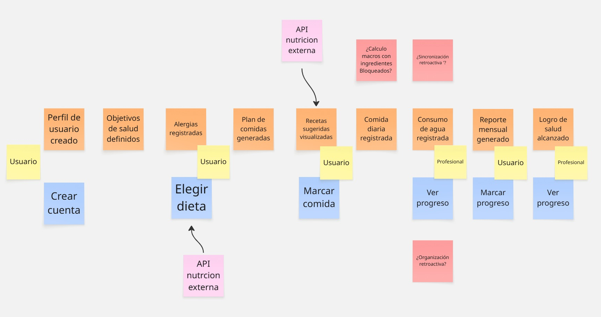
</p>


### 2.5. Ubiquitous Language

Este será el lenguaje que se utilizará para distintos elementos de la aplicación, encapsulando funciones clave o permitiendo un mejor reconocimiento del significado.

#### User
- Persona joven-adulta interesada en mejorar su bienestar mediante una alimentación personalizada y saludable.

#### Nutritionist
- Profesional de la salud especializado en nutrición, que utiliza la plataforma para monitorear y personalizar planes nutricionales de sus pacientes.

#### Plan
- Programa personalizado de alimentación, adaptado a las metas, restricciones y preferencias del usuario.

#### Tracking
- Registro diario de comidas, hábitos, actividad física y progresos que alimenta el sistema de personalización de la app.

#### Support
- Asistencia humana o automática disponible para resolver dudas, dar recomendaciones y acompañar el progreso del usuario.

#### Insights
- Análisis automáticos de los datos de tracking, que proporcionan retroalimentación visual sobre avances, áreas de mejora o riesgos potenciales.

#### Membership
- Suscripción premium que desbloquea beneficios adicionales como planes avanzados, consultas con nutricionistas, o recomendaciones basadas en IA.

#### Reward
- Sistema de logros y reconocimientos visuales para motivar el cumplimiento de metas saludables.


# Capítulo III: Requirements Specification 

## 3.1 User Stories

| Epic / Story ID | Título | Descripción | Criterios de Aceptación | Relacionado con (Epic ID) |
|:---------------|:-------|:------------|:------------------------|:-------------------------|
| US-01 | Registro de Usuario | Como usuario quiero crear un perfil con mis datos personales para recibir recomendaciones personalizadas. | Escenario 1: **Given** que soy un nuevo usuario, **When** completo mi información inicial, **Then** la app me mostrará sugerencias alimenticias adaptadas. <br><br> Escenario 2: **Given** que omito algunos datos en el registro inicial, **When** ingreso a la sección de perfil y completo la información faltante, **Then** la app actualizará y personalizará mis sugerencias alimenticias. | EP-01 |
| US-02 | Personalización de Objetivos | Como usuario, quiero configurar mis objetivos de salud para recibir sugerencias alineadas a mis metas. | Escenario 1: **Given** que soy un usuario registrado, **When** configuro mis objetivos de salud, **Then** recibiré recomendaciones nutricionales personalizadas. <br><br> Escenario 2: **Given** que mis objetivos de salud cambian con el tiempo, **When** actualizo mis metas en el perfil, **Then** la app me sugerirá nuevos planes alineados automáticamente. | EP-01 |
| US-03 | Selección de Preferencias Alimenticias | Como usuario, quiero seleccionar mis preferencias alimenticias para recibir sugerencias compatibles. | Escenario 1: **Given** que soy un usuario registrado, **When** selecciono mis preferencias alimenticias, **Then** las recomendaciones se adaptarán a mis gustos. <br><br> Escenario 2: **Given** que cambio mis preferencias alimenticias, **When** actualizo mis opciones en la app, **Then** las sugerencias se recalibrarán automáticamente. | EP-01 |
| US-04 | Registro de Consumo Diario | Como usuario, quiero registrar mis comidas diarias para llevar un control de mi alimentación. | Escenario 1: **Given** que soy un usuario activo, **When** registro una nueva comida, **Then** la app actualizará mi historial de alimentación. <br><br> Escenario 2: **Given** que me olvido de registrar una comida, **When** ingreso después de un tiempo, **Then** la app me permitirá registrar comidas retroactivas. | EP-01 |
| US-06 | Ver resumen de beneficios | Como visitante, quiero ver los beneficios que ofrece la app para entender cómo me puede ayudar. | Escenario 1: **Given** que accedo a la landing page, **When** hago scroll a la sección de beneficios, **Then** visualizo tarjetas con los puntos destacados. | EP-12 |
| US-07 | Ajuste de Plan Nutricional | Como usuario, quiero ajustar mi plan nutricional si cambian mis necesidades o preferencias. | Escenario 1: **Given** que detecto cambios en mis necesidades, **When** solicito un ajuste, **Then** la app recalculará mis recomendaciones. <br><br> Escenario 2: **Given** que mi historial muestra inconsistencias, **When** pido actualizar el plan, **Then** la app me guiará para ajustar objetivos y preferencias. | EP-02 |
| US-08 | Visualizar testimonios | Como visitante, quiero leer testimonios de usuarios para confiar en la app. | Escenario 1: **Given** que llegó a la sección de testimonios, **When** visualizó las citas de usuarios, **Then** puedo ver nombre, foto y experiencia de cada uno. | EP-12 |
| US-09 | Acceder desde distintos dispositivos | Como visitante, quiero que la landing page se vea bien en cualquier dispositivo para poder explorarla cómodamente. | Escenario 1: **Given** que accedo desde un dispositivo móvil, **When** cargo la landing, **Then** el diseño se adapta correctamente. <br><br> Escenario 2: **Given** que accedo desde una computadora, **When** navego la landing, **Then** los elementos se ajustan al tamaño de pantalla. | EP-13 |
| US-10 | Conocer la propuesta de valor | Como visitante, quiero entender rápidamente qué hace la app y cómo me beneficia. | Escenario 1: **Given** que ingreso a la landing, **When** visualizo la parte superior, **Then** leo un título claro y un subtítulo explicativo. | EP-12 |
| US-11 | Navegar por los beneficios principales | Como visitante, quiero navegar fácilmente por la sección de beneficios para conocer todas las ventajas. | Escenario 1: **Given** que hago scroll en la página, **When** paso por cada bloque de beneficios, **Then** veo textos e imágenes que explican las funcionalidades. | EP-12 |
| US-12 | Navegar entre secciones desde la barra | Como visitante, quiero usar la barra superior para moverme a distintas secciones de la landing para explorar el contenido rápidamente | Escenario 1: **Given** que hago clic en un enlace del menú superior, **When** este se refiere a una sección de la misma página, **Then** soy dirigido automáticamente a dicha sección. | EP-12 |
| US-13 | Acceder al registro o inicio de sesión | Como visitante, quiero poder iniciar sesión o registrarme desde la barra superior para empezar a usar la app. | Escenario 1: **Given** que hago clic en el botón "Iniciar sesión", **When** este me redirige, **Then** llego a la página de login. <br><br> Escenario 2: **Given** que hago clic en "Registrarse", **When** este me redirige, **Then** llego al formulario de registro. | EP-14 |
| US-14 | Navegar desde el footer | Como visitante, quiero que los enlaces del pie de página funcionen correctamente para poder acceder a información adicional sobre la app. | Escenario 1: **Given** que hago clic en un enlace del footer, **When** este está correctamente configurado, **Then** soy redirigido a la sección o página correspondiente (por ejemplo, "Política de privacidad", "Contacto", etc.). | EP-12 |
| US-15 | Envío de Sugerencias Semanales | Como usuario, quiero recibir sugerencias semanales de menús adaptados a mis objetivos. | Escenario 1: **Given** que estoy suscrito a las notificaciones, **When** inicia una nueva semana, **Then** recibiré un resumen con menús sugeridos. <br><br> Escenario 2: **Given** que mis objetivos cambian, **When** actualizo mi perfil, **Then** las próximas sugerencias reflejarán esos cambios. | EP-03 |
| US-22 | Control de Sesiones Activas | Como usuario, quiero ver y cerrar mis sesiones activas para mayor seguridad. | Escenario 1: **Given** que tengo varias sesiones abiertas, **When** accedo a la sección de seguridad, **Then** podré cerrar remotamente las sesiones que desee. <br><br> Escenario 2: **Given** que cierro todas las sesiones, **When** intento reingresar, **Then** me pedirá autenticarme nuevamente. | EP-07 |
| US-26 | Búsqueda de Recetas | Como usuario, quiero buscar recetas saludables dentro de la app. | Escenario 1: **Given** que estoy en la sección de recetas, **When** escribo un ingrediente o platillo, **Then** la app me mostrará resultados relevantes. <br><br> Escenario 2: **Given** que no hay resultados, **When** finaliza la búsqueda, **Then** la app sugerirá alternativas similares. | EP-02 |
| US-27 | Filtrado de Recetas | Como usuario, quiero filtrar recetas por tipo de dieta o restricción alimentaria. | Escenario 1: **Given** que selecciono un filtro, **When** aplico la búsqueda, **Then** solo veré recetas que cumplan esos criterios. <br><br> Escenario 2: **Given** que elimino los filtros, **When** vuelvo a buscar, **Then** veré todas las recetas disponibles. | EP-05 |
| US-28 | Favoritos de Recetas | Como usuario, quiero guardar recetas favoritas para consultarlas rápidamente después. | Escenario 1: **Given** que estoy viendo una receta, **When** la marco como favorita, **Then** se añadirá a mi lista personal. <br><br> Escenario 2: **Given** que elimino una receta de favoritos, **When** confirmo la acción, **Then** desaparecerá de la lista. | EP-08 |
| US-29 | Visualización de Valor Nutricional | Como usuario, quiero ver el valor nutricional de las recetas sugeridas. | Escenario 1: **Given** que abro una receta, **When** despliego los detalles, **Then** podré ver información como calorías, proteínas, grasas y carbohidratos. <br><br> Escenario 2: **Given** que busco alternativas, **When** consulto valores nutricionales, **Then** podré comparar fácilmente opciones similares. | EP-06 |
| US-33 | Feedback de Uso Diario | Como usuario, quiero recibir feedback rápido al final del día sobre mi desempeño nutricional. | Escenario 1: **Given** que termino el día, **When** accedo al resumen diario, **Then** recibiré comentarios personalizados. <br><br> Escenario 2: **Given** que tengo días inconsistentes, **When** recibo feedback, **Then** la app me dará sugerencias específicas de mejora. | EP-09 |
| US-34 | Alertas de Objetivos No Alcanzados | Como usuario, quiero recibir alertas cuando no cumpla mis objetivos diarios. | Escenario 1: **Given** que no alcanzo un objetivo, **When** se cierra el día, **Then** recibiré una notificación sobre ello. <br><br> Escenario 2: **Given** que desactivo alertas, **When** lo configuro en preferencias, **Then** no recibiré recordatorios de objetivos fallidos. | EP-03 |
| US-34 | Recibir alertas por incumplimiento diario de objetivos | Como usuario, quiero recibir alertas cuando no cumpla mis objetivos diarios. | Escenario 1: **Given** que no alcanzo un objetivo, **When** se cierra el día, **Then** recibiré una notificación sobre ello. <br><br> Escenario 2: **Given** que desactivo alertas, **When** lo configuro en preferencias, **Then** no recibiré recordatorios de objetivos fallidos. | EP-03 |
| US-35 | Visualización de Macronutrientes | Como usuario, quiero ver la distribución de macronutrientes diarios que consumo. | Escenario 1: **Given** que registro comidas, **When** accedo a mi resumen diario, **Then** podré ver porcentajes de proteínas, grasas y carbohidratos. <br><br> Escenario 2: **Given** que selecciono un día anterior, **When** consulto macronutrientes, **Then** podré analizar los datos históricos. | EP-04 |
| US-38 | Ranking de Usuarios Saludables | Como usuario, quiero ver un ranking de usuarios según hábitos saludables. | Escenario 1: **Given** que participo activamente, **When** consulto el ranking, **Then** podré ver mi posición basada en cumplimiento de objetivos. <br><br> Escenario 2: **Given** que no deseo aparecer en rankings, **When** lo configuro, **Then** mi perfil será invisible en el listado. | EP-02 |
| US-41 | Reporte de Consumo de Agua | Como usuario, quiero ver un reporte mensual de mi hidratación. | Escenario 1: **Given** que registro mi hidratación diaria, **When** consulto mi reporte mensual, **Then** podré ver días cumplidos y consumo promedio. <br><br> Escenario 2: **Given** que no registro algunos días, **When** consulto el reporte, **Then** la app indicará los días faltantes en el análisis. | EP-08 |
| US-49 | Envío de Notificaciones Push Inteligentes | Como usuario, quiero recibir notificaciones push basadas en mi comportamiento. | Escenario 1: **Given** que hay patrones relevantes, **When** la app detecta eventos, **Then** enviará notificaciones personalizadas. <br><br> Escenario 2: **Given** que configuro la app para notificaciones inteligentes, **When** se active una condición, **Then** recibiré avisos específicos sin saturarme. | EP-05 |
| US-53 | Recomendaciones Basadas en Perfil Nutricional | Como usuario, quiero recibir recomendaciones de hábitos y recetas en función de mi perfil y objetivos. | Escenario 1: **Given** que tengo un objetivo de ganancia muscular, **When** recibo recomendaciones, **Then** estarán alineadas a ese objetivo. <br><br> Escenario 2: Given que cambio mis objetivos, When consulto nuevamente, Then las recomendaciones se actualizarán. | EP-05 |
| US-56 | Intercambio de idiomas en Landing Page | Como visitante internacional, quiero poder cambiar el idioma de la landing page desde un selector de idioma, para comprender fácilmente la información sin barreras lingüísticas. | **Given** que estoy en la landing page de la aplicación, **When** accedo al menú o ícono del selector de idioma, **Then** debería poder elegir entre varios idiomas disponibles y ver el contenido traducido automáticamente. | EP-12 |
| TS-57 | Agregar Alergia mediante API RESTful | Como desarrollador, quiero agregar una alergia mediante la API para que pueda almacenarse y ser utilizada en funcionalidades de personalización. | Escenario 1: **Given** que el endpoint "/api/v1/alergias_ingredientes" está disponible, **When** se envía una solicitud con nombre y descripción, **Then** se recibe un 201 y un recurso Alergia con id y datos. <br><br> Escenario 2: **Given** que se envía una alergia con nombre ya registrado, **When** se envía la solicitud, **Then** se recibe un 400 con mensaje de restricción de nombre duplicado. | EP-15 |
| TS-58 | Agregar Recomendaciones mediante API RESTful | Como desarrollador, quiero agregar recomendaciones mediante la API para que pueda ser asociado a recetas, alergias e ingredientes y plan de comida. | Escenario 1: **Given** que el endpoint "/api/v1/recomendaciones" está disponible, **When** se envía una recomendación de plan de comida o recetas, **Then** se recibe un 201 con el recurso Recomendación creado. <br><br> Escenario 2: **Given** que se envía una recomendación con nombre duplicado, **When** se realiza la petición, **Then** se recibe un 400 con mensaje de duplicado. | EP-15 |
| TS-59 | Crear Receta mediante API RESTful | Como desarrollador, quiero crear una receta mediante la API para que los usuarios puedan acceder a preparaciones personalizadas. | Escenario 1: **Given** que el endpoint "/api/v1/recetas" está disponible, **When** se envían nombre, instrucciones e ingredientes, **Then** se recibe un 201 con el recurso Receta creado. <br><br> Escenario 2: **Given** que la receta incluye ingredientes no existentes, **When** se realiza la petición, **Then** se recibe un 400 con mensaje de error. | EP-15 |
| TS-60 | Crear Plan de Comida mediante API RESTful | Como desarrollador, quiero crear un plan de comida mediante la API para que los usuarios reciban una guía diaria de alimentación.| Escenario 1: **Given** que el endpoint "/api/v1/planes-comida" está disponible, **When** se envía usuarioId, fechas y recetas, **Then** se recibe un 201 con el recurso Plan creado. <br><br> Escenario 2: **Given** que las fechas enviadas son inválidas, **When** se hace la solicitud, **Then** se recibe un 400 con mensaje de error. | EP-15 |
| TS-61 | Registrar Seguimiento mediante API RESTful | Como desarrollador, quiero registrar eventos de seguimiento nutricional mediante la API para que los profesionales puedan monitorear avances. | Escenario 1: **Given** que el endpoint "/api/v1/seguimiento" está disponible, **When** se envía usuarioId, fecha, peso, medidas y observaciones, **Then** se recibe un 201 con el seguimiento. <br><br> Escenario 2: **Given** que el usuario no existe, **When** se hace la solicitud, **Then** se recibe un 404 con mensaje de usuario no encontrado. | EP-15 |
| TS-62    | Configurar Entorno de Desarrollo        | Como desarrollador, quiero configurar mi entorno de desarrollo local para poder trabajar en el proyecto.                               | **Given** el desarrollador tiene acceso al repositorio del proyecto, **When** sigue las instrucciones de configuración, **Then** debería poder ejecutar la aplicación localmente. | EP-15  |
| TS-64    | Generación de Reportes de Progreso      | Como desarrollador, quiero crear una funcionalidad que genere reportes de progreso mensuales para que el usuario vea sus avances.       | **Given** que existe un historial de consumo y actividad, **When** se solicita el reporte mensual, **Then** el sistema genera un archivo con gráficos y métricas nutricionales. | EP-15  |
| TS-66    | Sistema de Notificaciones Personalizadas | Como desarrollador, quiero programar notificaciones personalizadas para recordar a los usuarios sus comidas, metas o revisiones pendientes. | **Given** que el usuario tiene recordatorios configurados, **When** llega la hora o el evento configurado, **Then** el sistema envía una notificación push o correo.           | EP-15  |
| TS-66    | Sistema de Notificaciones Personalizadas | Como desarrollador, quiero programar notificaciones personalizadas para recordar a los usuarios sus comidas, metas o revisiones pendientes. | **Given** que el usuario tiene recordatorios configurados, **When** llega la hora o el evento configurado, **Then** el sistema envía una notificación push o correo.| EP-15  |
| TS-67   | Edición de Datos del Perfil                   | Como usuario, quiero poder editar los datos de mi perfil de salud, incluyendo peso, altura y alergias, para mantener mi información actualizada.          | Escenario 1: **Given** que ya tengo un perfil creado, **When** actualizo mi información (peso, altura o alergias), **Then** el sistema debe guardar los nuevos valores.| EP-01   |
 | TS-68   | Eliminación de Perfil                         | Como usuario, quiero eliminar mi perfil de salud en caso de que ya no desee seguir usando funcionalidades personalizadas.                                  | Escenario 1: **Given** que tengo un perfil de usuario, **When** solicito su eliminación desde la configuración, **Then** el perfil debe ser eliminado y ya no usarse en sugerencias o seguimiento.| EP-01   |
 | TS-69   | Visualización General de Perfiles             | Como usuario, quiero consultar la lista completa de perfiles creados para poder gestionar mi información desde una interfaz de administración.             | Escenario 1: **Given** que tengo múltiples perfiles (o soy administrador), **When** accedo al listado, **Then** debo ver todos los perfiles registrados con sus datos clave.| EP-01   |
 | TS-70   | Creación de Objetivos                         | Como administrador, quiero crear y gestionar los objetivos generales de salud disponibles en la app para que los usuarios puedan seleccionarlos.          | Escenario 1: **Given** que soy administrador, **When** registro un nuevo objetivo de salud, **Then** debe quedar disponible para ser elegido por usuarios al configurar su perfil.| EP-01   |
 | TS-71   | Creación de Niveles de Actividad              | Como administrador, quiero definir distintos niveles de actividad física para que los usuarios puedan seleccionar el que mejor se adapte a su estilo.     | Escenario 1: **Given** que soy administrador, **When** creo un nuevo nivel de actividad, **Then** los usuarios podrán seleccionarlo en su perfil personalizado.| EP-01   |
 | TS-72   | Registro de Alergias                          | Como nutricionista o administrador, quiero registrar nuevas alergias y asociarlas a ingredientes para mejorar la personalización de sugerencias.          | Escenario 1: **Given** que tengo una alergia y sus ingredientes asociados, **When** la registro en el sistema, **Then** quedará disponible para selección en perfiles de usuario.| EP-15   |
 | TS-73   | Consulta de Alergias Disponibles              | Como usuario, quiero consultar las alergias registradas en la plataforma para marcar las que me afectan.                                                   | Escenario 1: **Given** que estoy completando mi perfil, **When** accedo a la sección de alergias, **Then** debo ver una lista para seleccionar las que aplican a mí.| EP-15   |
  | TS-74   | Consulta de Niveles de Actividad              | Como usuario, quiero poder consultar los distintos niveles de actividad disponibles para elegir el que se ajuste a mi rutina diaria.                       | Escenario 1: **Given** que estoy personalizando mi perfil, **When** veo la sección de niveles de actividad, **Then** podré elegir el que mejor se alinee a mi estilo de vida.| EP-01   |
 | TS-75   | Consulta de Objetivos Disponibles             | Como usuario, quiero poder ver todos los objetivos de salud existentes para elegir uno que se alinee con mis metas personales.                            | Escenario 1: **Given** que estoy en el registro o edición de perfil, **When** accedo a los objetivos, **Then** podré seleccionar entre los registrados en la plataforma.| EP-01   |
| TS-76 | Endpoint de Ajuste de Plan Nutricional | Como desarrollador, quiero un endpoint RESTful que permita actualizar un plan de comida existente para que el usuario pueda ajustar su plan nutricional según sus necesidades. | Escenario: **Given** un `mealPlanId` válido, **When** se invoca `PUT /api/v1/meal-plan/{mealPlanId}`, **Then** el plan se actualiza y responde `200 OK`. | EP-08 |
| TS-77           | Endpoint de Búsqueda de Recetas       | Como desarrollador, quiero un endpoint RESTful que permita buscar recetas por nombre, ingredientes o tipo, para que los usuarios puedan encontrar fácilmente recetas saludables según sus criterios de búsqueda. | **Escenario:** Given parámetros de búsqueda (`q`, `ingredients`, `type`), when invoco `GET /api/v1/recipes?…`, then la API responde `200 OK` con la lista de recetas que coinciden. | EP-02                     |
| TS-78           | Gestión de Recipe Types | Como desarrollador, quiero endpoints RESTful para listar, crear y obtener tipos de receta, para gestionar el catálogo de tipos de receta.                         | **Escenario:** Given llamadas a `GET /api/v1/recipetypes`, `POST /api/v1/recipetypes` con payload válido y `GET /api/v1/recipetypes/{recipeTypeId}` con ID existente, When invoco cada endpoint, Then responden con `200 OK` | EP-15                     |
| TS-79           | Gestión de Ingredients  | Como desarrollador, quiero endpoints RESTful para listar y crear ingredientes, para gestionar el catálogo de ingredientes.                                         | **Escenario:** Given llamadas a `GET /api/v1/ingredients` y `POST /api/v1/ingredients` con payload válido, When invoco cada endpoint, Then responden con `200 OK`             | EP-15                     |
| TS-80           | Gestión de Categories   | Como desarrollador, quiero endpoints RESTful para listar, crear y obtener categorías, para gestionar el catálogo de categorías de recetas.                         | **Escenario:** Given llamadas a `GET /api/v1/categories`, `POST /api/v1/categories` con payload válido y `GET /api/v1/categories/{categoryId}` con ID existente, When invoco cada endpoint, Then responden con `200 OK`  | EP-15                     |
| TS-81           | Gestión de Recommendations          | Como desarrollador, quiero endpoints RESTful para crear, actualizar, listar y eliminar recomendaciones, para ofrecer sugerencias personalizadas a los usuarios.    | **Escenario:** Given un payload válido o un `recommendationId` y `userId`, when invoco `POST`, `PUT`, `GET /api/v1/recommendations/user/{userId}` o `DELETE /api/v1/recommendations/{recommendationId}`, then la API responde con el código correspondiente (`201 Created`, `200 OK`. | EP-11                     |
| TS-82           | Gestión de Recommendation Templates | Como desarrollador, quiero endpoints RESTful para listar y crear plantillas de recomendación, para definir formatos reutilizables de sugerencias nutricionales.     | **Escenario:** Given llamadas a `GET /api/v1/recommendation-templates` y `POST /api/v1/recommendation-templates` con payload válido, when invoco cada endpoint, then la API responde con `200 OK` .                    | EP-11                     |
| TS-83           | Gestión de Seguimiento Nutricional | Como desarrollador, quiero endpoints RESTful para gestionar el tracking, metas nutricionales, macronutrientes consumidos y entradas de plan de comida, para registrar y analizar la alimentación del usuario. | **Escenario:** Given un `userId` o `trackingId`, when invoco los endpoints `POST /tracking`, `POST /tracking-goals`, `POST /meal-plan-entries/{trackingId}` o `PUT /meal-plan-entries/{mealPlanEntryId}`, then la API responde con `201 Created. | EP-03                     |
| TS-84           | Consulta de Datos Nutricionales    | Como desarrollador, quiero endpoints RESTful para obtener datos detallados del progreso nutricional del usuario, incluyendo objetivos, historial de consumo y desglose de macronutrientes. | **Escenario:** Given un `trackingId`, `trackingGoalId` o `userId`, when invoco los endpoints , then la API responde con `200 OK` y los datos solicitados.      | EP-03                     |
| US-85 | Ver video del equipo de desarrollo | Como usuario, quiero poder ver un video acerca del equipo de desarrollo y su experiencia y desempeño al realizar este proyecto, para entender mejor quiénes están detrás de la aplicación y su trayectoria. | **Escenario:** Given que soy un usuario registrado y he iniciado sesión en la app, when navego a la sección “Sobre nosotros” y pulso el botón “Ver video del equipo”, then se reproducirá un video que presenta al equipo de desarrollo, sus roles, experiencia y contribuciones al proyecto. | EP-07 |

#### Épica 1: Gestión de Perfil y Personalización Inicial

| Story ID | Título                                                         |
|----------|-----------------------------------------------------------------|
| US-01    | Crear perfil personal                                           |
| US-02    | Ingresar objetivos de salud                                     |
| US-03    | Registrar alergias alimentarias                                 |
| US-04    | Seleccionar comidas favoritas                                   |
| TS-67   | Edición de Datos del Perfil                                     |
| TS-68   | Eliminación de Perfil                                           |
| TS-69   | Visualización General de Perfiles                               |
| TS-70   | Creación de Objetivos                                           |
| TS-71   | Creación de Niveles de Actividad                                |
| TS-74   | Consulta de Niveles de Actividad                                |
| TS-75   | Consulta de Objetivos Disponibles                               |

#### Épica 2: Planificación y Visualización de Dietas

| Story ID | Título                                                         |
|----------|-----------------------------------------------------------------|
| US-07    | Recibir plan de comidas semanal automático                     |
| US-08    | Ver recetas paso a paso                                         |
| US-26    | Descargar plan de comidas en PDF                                |
| US-38    | Ver vista previa de menús semanales                             |
| TS-77   | Endpoint de Búsqueda de Recetas                                 |

#### Épica 3: Tracking y Seguimiento Diario

| Story ID | Título                                                         |
|----------|-----------------------------------------------------------------|
| US-10    | Marcar comidas como hechas                                      |
| US-12    | Ajustar plan si cambian objetivos                               |
| US-13    | Ver resumen semanal de avances                                  |
| US-14    | Registrar cambios físicos o emocionales                         |
| US-15    | Registrar peso regularmente                                     |
| US-34    | Registrar comidas fuera del plan                                |
| TS-83   | Gestión de Seguimiento Nutricional                              |
| TS-84   | Consulta de Datos Nutricionales                                 |

#### Épica 4: Motivación y Gamificación

| Story ID | Título                                                         |
|----------|-----------------------------------------------------------------|
| US-35    | Recibir felicitaciones/logros                                   |

#### Épica 5: Notificaciones y Recordatorios Inteligentes

| Story ID | Título                                                         |
|----------|-----------------------------------------------------------------|
| US-06    | Recordatorio de comida                                         |
| US-27    | Recibir alertas cuando no se cumple el plan                    |
| US-49    | Recibir alertas de dieta desbalanceada                         |
| US-53    | Recomendaciones Basadas en Perfil Nutricional                  |

#### Épica 6: Interacción con el Soporte Humano

| Story ID | Título                                                         |
|----------|-----------------------------------------------------------------|
| US-29    | Acceder a foro de comunidad                                    |

#### Épica 7: Contenido Educativo y Recursos Adicionales

| Story ID | Título                                                         |
|----------|-----------------------------------------------------------------|
| US-22    | Acceder a contenido educativo de nutrición                     |
| US-85    | Ver video del equipo de desarrollo                             |

#### Épica 8: Adaptabilidad y Flexibilidad del Plan

| Story ID | Título                                                         |
|----------|-----------------------------------------------------------------|
| US-28    | Personalizar horarios de comida                                |
| US-41    | Bloquear ingredientes no deseados                              |
| TS-76   | Endpoint de Ajuste de Plan Nutricional                         |

#### Épica 9: Funciones Avanzadas de Registro y Conectividad

| Story ID | Título                                                         |
|----------|-----------------------------------------------------------------|
| US-33    | Calcular consumo de agua ideal                                 |

    |

#### Épica 11: Optimización Basada en Análisis

| Story ID | Título                                                         |
|----------|-----------------------------------------------------------------|
| US-19    | Recibir recomendaciones basadas en progreso                    |
| TS-81   | Gestión de Recommendations                                    |
| TS-82   | Gestión de Recommendation Templates                            |

#### Épica 12: Comunicación de Propuesta de Valor

| Story ID | Título                                                         |
|----------|-----------------------------------------------------------------|
| US-10    | Conocer la propuesta de valor                                  |
| US-12    | Navegar entre secciones desde la barra                         |
| US-06    | Ver resumen de beneficios                                      |
| US-11    | Navegar por los beneficios principales                        |
| US-08    | Visualizar testimonios                                         |
| US-14    | Navegar desde el footer                                        |

#### Épica 13: Diseño Responsivo y Experiencia Multidispositivo

| Story ID | Título                                                         |
|----------|-----------------------------------------------------------------|
| US-09    | Acceder desde distintos dispositivos                           |

#### Épica 14: Accesos a Plataforma (Login / Registro)

| Story ID | Título                                                         |
|----------|-----------------------------------------------------------------|
| US-13    | Acceder al registro o inicio de sesión                         |

#### Épica 15: Gestión Integral de Información Nutricional

| Story ID | Título                                                         |
|----------|-----------------------------------------------------------------|
| TS-56    | Registrar alergia e ingrediente desde API                      |
| TS-57    | Registrar recomendaciones desde API                            |
| TS-58    | Crear receta desde API                                         |
| TS-59    | Crear plan de comida desde API                                 |
| TS-60    | Añadir registro de seguimiento nutricional vía API             |
| TS-61    | Configurar Entorno de Desarrollo                               |
| TS-62    | Implementar Endpoint para Registro de Usuario                  |
| TS-64    | Módulo de Recomendaciones Dinámicas                            |
| TS-72   | Registro de Alergias                                           |
| TS-73   | Consulta de Alergias Disponibles                               |
| TS-78   | Gestión de Recipe Types                                        |
| TS-79   | Gestión de Ingredients                                        |
| TS-80   | Gestión de Categories                                         |


## 3.2 Impact Mapping


## 3.3 Product Backlog

| #Orden | ID     | Título                               | Descripción                                                                                       | Story Points |
|--------|--------|--------------------------------------|---------------------------------------------------------------------------------------------------|--------------|
| 1      | US-06  | Ver resumen de beneficios            | Como visitante, quiero ver los beneficios que ofrece la app para entender cómo me puede ayudar.  | 3            |
| 2      | US-08  | Visualizar testimonios               | Como visitante, quiero leer testimonios de usuarios para confiar en la app.                      | 2            |
| 3      | US-09  | Acceder desde distintos dispositivos | Como visitante, quiero que la landing page se vea bien en cualquier dispositivo para explorarla. | 5            |
| 4      | US-10  | Conocer la propuesta de valor        | Como visitante, quiero entender rápidamente qué hace la app y cómo me beneficia.                | 3            |
| 5      | US-11  | Navegar por los beneficios principales | Como visitante, quiero navegar fácilmente por la sección de beneficios para conocer todas las ventajas. | 3       |
| 6      | US-12  | Navegar entre secciones desde la barra | Como visitante, quiero usar la barra superior para moverme a distintas secciones.               | 2            |
| 7      | US-13  | Acceder al registro o inicio de sesión | Como visitante, quiero poder iniciar sesión o registrarme desde la barra superior.             | 3            |
| 8      | US-14  | Navegar desde el footer              | Como visitante, quiero que los enlaces del pie de página funcionen correctamente.                | 2            |
| 9      | US-56  | Intercambiar idiomas                 | Como visitante internacional, quiero poder cambiar el idioma de la landing page desde un selector de idioma, para comprender fácilmente la información sin barreras lingüísticas. | 5 |
| 10     | TS-70  | Creación de Objetivos                | Como administrador, quiero crear y gestionar los objetivos generales de salud disponibles en la app.                      | 3            |
| 11     | TS-71  | Creación de Niveles de Actividad     | Como administrador, quiero definir distintos niveles de actividad física.                                                  | 3            |
| 12     | TS-72  | Registro de Alergias                 | Como nutricionista o administrador, quiero registrar nuevas alergias.                                                      | 3            |
| 13     | TS-56  | Agregar Alergia mediante API RESTful | Como desarrollador, quiero agregar una alergia mediante la API para que pueda almacenarse y ser utilizada en funcionalidades de personalización.                                               | 5            |
| 14     | TS-57  | Agregar Recomendaciones mediante API RESTful | Como desarrollador, quiero agregar recomendaciones mediante la API para que pueda ser asociado a recetas, alergias e ingredientes y plan de comida.                                         | 8            |
| 15     | TS-58  | Crear Receta mediante API RESTful    | Como desarrollador, quiero crear una receta mediante la API para que los usuarios puedan acceder a preparaciones personalizadas.                                 | 5            |
| 16     | TS-59  | Crear Plan de Comida mediante API RESTful | Como desarrollador, quiero crear un plan de comida mediante la API para que los usuarios reciban una guía diaria de alimentación.                                                         | 5            |
| 17     | TS-60  | Registrar Seguimiento mediante API RESTful | Como desarrollador, quiero registrar eventos de seguimiento nutricional mediante la API para que los profesionales puedan monitorear avances.                                             | 5            |
| 18     | TS-61  | Configurar Entorno de Desarrollo     | Como desarrollador, quiero configurar mi entorno de desarrollo local para poder trabajar en el proyecto. | 5 |
| 19     | TS-62  | Implementar Endpoint para Registro de Usuario | Como desarrollador, quiero implementar una API que permita registrar nuevos usuarios al sistema. | 5 |
| 20     | TS-64  | Módulo de Recomendaciones Dinámicas  | Como desarrollador, quiero implementar un módulo que actualice las recomendaciones nutricionales automáticamente según los registros del usuario. | 8 |
| 21     | TS-76  | Endpoint de Ajuste de Plan Nutricional | Como desarrollador, quiero un endpoint RESTful que permita actualizar un plan de comida existente para que el usuario pueda ajustar su plan nutricional según sus necesidades. | 5            |
| 22     | TS-77  | Endpoint de Búsqueda de Recetas      | Como desarrollador, quiero un endpoint RESTful que permita buscar recetas por nombre, ingredientes o tipo, para que los usuarios puedan encontrar fácilmente recetas saludables según sus criterios de búsqueda. | 5            |
| 23     | TS-78  | Gestión de Recipe Types              | Como desarrollador, quiero endpoints RESTful para listar, crear y obtener tipos de receta, para gestionar el catálogo de tipos de receta.                         | 5            |
| 24     | TS-79  | Gestión de Ingredients               | Como desarrollador, quiero endpoints RESTful para listar y crear ingredientes, para gestionar el catálogo de ingredientes.                                         | 5            |
| 25     | TS-80  | Gestión de Categories                | Como desarrollador, quiero endpoints RESTful para listar, crear y obtener categorías, para gestionar el catálogo de categorías de recetas.                         | 5            |
| 26     | TS-81  | Gestión de Recommendations           | Como desarrollador, quiero endpoints RESTful para crear, actualizar, listar y eliminar recomendaciones, para ofrecer sugerencias personalizadas a los usuarios.    | 8            |
| 27     | TS-82  | Gestión de Recommendation Templates  | Como desarrollador, quiero endpoints RESTful para listar y crear plantillas de recomendación, para definir formatos reutilizables de sugerencias nutricionales.     | 5            |
| 28     | TS-83  | Gestión de Seguimiento Nutricional   | Como desarrollador, quiero endpoints RESTful para gestionar el tracking, metas nutricionales, macronutrientes consumidos y entradas de plan de comida, para registrar y analizar la alimentación del usuario. | 8            |
| 29     | TS-84  | Consulta de Datos Nutricionales      | Como desarrollador, quiero endpoints RESTful para obtener datos detallados del progreso nutricional del usuario, incluyendo objetivos, historial de consumo y desglose de macronutrientes. | 5            |
| 30     | US-01  | Registro de Usuario                  | Como usuario quiero crear un perfil con mis datos personales para recibir recomendaciones.       | 5            |
| 31     | US-04  | Registro de Consumo Diario           | Como usuario, quiero registrar mis comidas diarias para llevar un control de mi alimentación.    | 5            |
| 32     | US-25  | Acceso como Invitado                 | Como usuario, quiero acceder como invitado para explorar funcionalidades básicas.                | 3            |
| 33     | US-22  | Control de Sesiones Activas          | Como usuario, quiero ver y cerrar mis sesiones activas para mayor seguridad.                     | 5            |
| 34     | US-02  | Personalización de Objetivos         | Como usuario, quiero configurar mis objetivos de salud para recibir sugerencias alineadas.       | 5            |
| 35     | US-03  | Selección de Preferencias Alimenticias | Como usuario, quiero seleccionar mis preferencias alimenticias para recibir sugerencias compatibles. | 5        |
| 36     | US-07  | Ajuste de Plan Nutricional           | Como usuario, quiero ajustar mi plan nutricional si cambian mis necesidades.                     | 5            |
| 37     | US-15  | Envío de Sugerencias Semanales       | Como usuario, quiero recibir sugerencias semanales de menús adaptados.                           | 5            |
| 38     | US-19  | Creación de Grupos de Apoyo          | Como usuario, quiero unirme a grupos con objetivos similares para motivación.                    | 8            |
| 39     | US-26  | Búsqueda de Recetas                  | Como usuario, quiero buscar recetas saludables dentro de la app.                                 | 5            |
| 40     | US-27  | Filtrado de Recetas                  | Como usuario, quiero filtrar recetas por tipo de dieta o restricción.                            | 5            |
| 41     | US-28  | Favoritos de Recetas                 | Como usuario, quiero guardar recetas favoritas.                                                  | 3            |
| 42     | US-29  | Visualización de Valor Nutricional   | Como usuario, quiero ver el valor nutricional de las recetas.                                    | 5            |
| 43     | US-53  | Recomendaciones Basadas en Perfil Nutricional | Como usuario, quiero recibir recomendaciones de hábitos y recetas en función de mi perfil y objetivos.             | 3            |
| 44     | US-33  | Comparativa con Objetivos            | Como usuario, quiero comparar mi ingesta diaria con mis objetivos para ajustar mi comportamiento. | 5            |
| 45     | US-34  | Consejos Personalizados              | Como usuario, quiero recibir consejos según mis datos y hábitos para mejorar mi nutrición.       | 5            |
| 46     | US-35  | Visualización de Historial           | Como usuario, quiero revisar mis registros anteriores para identificar patrones.                 | 3            |
| 47     | US-38  | Visualización de Macronutrientes     | Como usuario, quiero visualizar proteínas, carbohidratos y grasas en mi dieta para balancearla mejor. | 5       |
| 48     | US-41  | Visualización de Ingredientes        | Como usuario, quiero ver los ingredientes de cada receta para saber si se ajustan a mis preferencias. | 3       |
| 49     | US-49  | Configuración de Idioma              | Como usuario, quiero cambiar el idioma de la app para usarla en mi idioma nativo.               | 2            |
| 50     | TS-67  | Edición de Datos del Perfil          | Como usuario, quiero poder editar los datos de mi perfil de salud, incluyendo peso, altura y alergias.                    | 3            |
| 51     | TS-68  | Eliminación de Perfil                | Como usuario, quiero eliminar mi perfil de salud en caso de que ya no desee seguir usando funcionalidades personalizadas. | 2            |
| 52     | TS-69  | Visualización General de Perfiles    | Como usuario, quiero consultar la lista completa de perfiles creados para poder gestionarlos.                             | 2            |
| 53     | TS-73  | Consulta de Alergias Disponibles     | Como usuario, quiero consultar las alergias registradas en la plataforma.                                                  | 2            |
| 54     | TS-74  | Consulta de Niveles de Actividad     | Como usuario, quiero consultar los niveles de actividad disponibles.                                                       | 2            |
| 55     | TS-75  | Consulta de Objetivos Disponibles    | Como usuario, quiero consultar los objetivos de salud existentes.                                                          | 2            |
| 56     | US-85  | Ver video del equipo de desarrollo   | Como usuario, quiero poder ver un video acerca del equipo de desarrollo y su experiencia y desempeño al realizar este proyecto, para entender mejor quiénes están detrás de la aplicación y su trayectoria. | 3 |


<hr>

# Capítulo IV: Product Design 

## 4.1. Style Guidelines. 

### 4.1.1. General Style Guidelines. 

**Branding**

El logo de nuestra plataforma, el cual representa comida saludable y una buena dieta a traves del color verde. Se busca que el usuario capte que queremos ayudarlo brindandole apoyo con planes alimenticios semanales


**Typography**

Para el diseño de BiteWise, hemos seleccionado dos fuentes sans serif complementarias: Roboto (utilizando únicamente Bold y Semibold) y Poppins (en Regular, Medium, Semibold y Bold).
Esta combinación garantiza claridad y accesibilidad: Roboto proporciona solidez y prominencia para los elementos principales; Poppins, con sus formas suaves, facilita la lectura fluida de textos extensos y componentes de la interfaz.
Decisiones de diseño <br>
Roboto (Bold / Semibold)
 Reservado para el logotipo de "BiteWise" y los encabezados principales (como el hero y H1). Su estilo robusto asegura una fuerte presencia visual y legibilidad óptima en tamaños amplios.

Poppins (Regular / Medium / Semibold / Bold)
 Empleado en subtítulos, párrafos, botones, etiquetas, campos de entrada y notificaciones del sistema. Su diseño geométrico y amigable refuerza el carácter acogedor de la marca.


**Colors**

La paleta de colores de BiteWise ha sido elegida para transmitir frescura, salud y confianza, inspirada en elementos naturales como frutas y verduras frescas. Se organiza en tres categorías principales:

Paleta principal: Colores que definen la esencia de BiteWise y se aplican en componentes centrales.

Primario (Verde Fresco): var(--primary-color) (tono principal para botones y acentos).
Secundario (Negro): var(--secondary-color) (para texto principal y elementos interactivos).
Terciario (Blanco): var(--tertiary-color) (para texto secundario y detalles sutiles).
Fondo Verde Claro: var(--bg-light) (fondos de secciones para un aspecto aireado).
Fondo Blanco: var(--white) (fondos de tarjetas y áreas principales).

Paleta de Soporte: Colores auxiliares que aportan equilibrio y variedad.

Morado intenso: Para resaltar algun boton.
Azul Claro: Para enlaces y elementos de navegación.

**Spacing**

El espaciado en BiteWise web sigue un sistema modular y predecible que organiza visualmente la información sobre nuestro servicio. Permite una mejor visualización brindando a nuestros usuarios legibilidad y armonía en cada sección.

Espaciado Básico: Utilizamos 8px como unidad base. Todos los espaciados derivan de múltiplos de esta unidad (8px, 16px, 24px, 32px, 48px, 64px).

Margen Interno (Padding): Las secciones principales utilizan padding vertical de 64px y padding horizontal de 32px, creando márgenes de contención que priorizan el contenido sin que se vea estrecho.

Espacio entre Elementos: Las tarjetas de beneficios, planes o recursos se separan por un espacio de 24px. Los elementos dentro de cada tarjeta usan 16px de separación, creando una jerarquía visual clara y facilitando la exploración del contenido.

Line Height del Texto: Los párrafos descriptivos en landing page usan un interlineado de 1.7, para mejorar la legibilidad de los textos largos. Los títulos y subtítulos usan un interlineado de 1.3, concentrando visualmente el mensaje.

**Tono de comunicación**

Bitewise tiene un tono y voz que reflejan ser agradable y cercano ya que se busca que nuestros usuarios confien en la plataforma para seguir el plan saludable. Además de usar un tono profesional para comunicar que la salud es muy importante

Tono: Cercano y confiable, con un toque de optimismo. Queremos que nuestro usuario tenga confianza en nosotros para que sepa que queremos lo mejor para él.

Actitud: Informada y empática. El 80% de nuestro mensaje es tranquilizador y fundamentado, mientras que el 20% es inspirador para que se motive a seguir el plan alimenticio.

Lenguaje: Accesible y directo. Evitamos usar lenguaje coloquial para evitar confundir a nuestros usuarios. Intentamos ser directos para dejar en claro lo que buscamos.

Voz: Experta y motivadora. Buscamos que nuestra solución se vea experta para generar confianza y motivadora para animar a nuestros usuarios a seguir el plan alimenticio


### 4.1.2. Web Style Guidelines.

4.1.2. Web Style Guidelines

Las directrices de estilo web de nuestro proyecto priorizan la claridad, la accesibilidad y la coherencia visual. Buscamos que cada usuario disfrute de una experiencia intuitiva y agradable, alineada con los valores de la plataforma.

1) Layout

Grid adaptable: El contenido se organiza en una cuadrícula flexible que se ajusta a diferentes tamaños de pantalla, manteniendo siempre el orden y la legibilidad.

Encabezado y pie de página: El header permanece visible para facilitar la navegación, mientras que el footer incluye enlaces útiles y datos de contacto.

Tarjetas: Utilizamos tarjetas con esquinas suaves y sombras ligeras para destacar información clave y mejorar la jerarquía visual.

2) Responsive Design

Desktop: La navegación principal y las acciones importantes están siempre accesibles. El contenido se distribuye en varias columnas para aprovechar el espacio.

Tablet: El menú se simplifica y los elementos se reorganizan en dos columnas. Los botones y campos se agrandan para facilitar la interacción táctil.

Mobile: Todo el contenido se adapta a una sola columna, con menús desplegables y botones grandes para una experiencia óptima en dispositivos móviles.

3) Interaction Design

Botones: Los botones son visibles y responden con animaciones suaves al interactuar, facilitando la comprensión de su función.

Formularios: Los formularios son breves y claros, con campos bien separados para evitar errores y mejorar la usabilidad.

4) Images and Icons

Imágenes: Se emplean imágenes optimizadas que transmiten confianza y cercanía, reforzando el mensaje de la plataforma.

Íconos: Los íconos son simples y consistentes, ayudando a identificar rápidamente funciones y secciones.

5) Organización de Recursos

Estructura: Los archivos de estilos se encuentran en assets/styles, los scripts en assets/js y los recursos gráficos en assets/img. Esta organización facilita el mantenimiento y la colaboración.

Control de versiones: Se utiliza Git para gestionar los cambios y asegurar que todos los miembros trabajen sobre la última versión del proyecto.

## 4.2. Information Architecture. 

La arquitectura de BiteWise fue diseñada para facilitar la búsqueda de informacion que necesiten nuestros usuarios de forma intuitiva y sin ser invasiva.

### 4.2.1. Organization Systems. 

**Jerarquia**

Brindamos la información de forma escalonada. Primero mostramos lo general y luego se dirigen a lo más específico. Iniciamos mostrando un boton de Plan, luego se elige si quieres crear alguno o revisar el que ya tenia, y finalmente crea un plan alimenticio donde podrá visualizarlo e interactuar con él.

**Secciones principales**

- Plan: Elaborar un plan o revisarlo
- Cuenta: Modifica la cuenta
- Añadir Nutricionista: Vincula un nutricionista con el cliente
- Recetas: Para revisar y aprender recetas
- Preferencias: Añade las preferencias del usuario
- Nutricionista: El usuario chatea con un nutricionista
- Noticias: Para buscar noticias actuales o guardadas
- Estudios: Para hallar estudios de nutrición previos

### 4.2.2. Labeling Systems. 

**Nomenclatura**
Las etiquetas tienen nombre que facilitan al usuario lo que esperaria que hagan, como un boton que dice planes, recetas o log in

**Consistencia**
Cuando el usuario es redirigido a traves de una etiqueta tambien se pondra ese nombre de la etiqueta en el título para facilitar la comprensión al usuario.

### 4.2.3. SEO Tags and Meta Tags 

El head usará las etiquetas title y meta, los cuales facilitará entender que hace esa sección. Además, en los Meta Tags se hará uso de descripción, keywords y autor.


### 4.2.4. Searching Systems.

Para evitar que los usuarios se pierdan entre el volumen de contenido, *BiteWise* ofrece múltiples sistemas de búsqueda adaptados a cada contexto:

| **Nombre del Filtro**       | **Descripción** |
|-----------------------------|-----------------|
| Buscar alimentos            | Herramienta para encontrar alimentos individuales por nombre o categoría (frutas, carnes, lácteos, etc.) y agregarlos al registro de comidas. |
| Buscar recetas guardadas    | Permite al usuario buscar entre sus recetas personalizadas por nombre del platillo o ingredientes utilizados previamente. |
| Buscar por ingredientes     | Posibilidad de escribir uno o varios ingredientes para encontrar recetas que los contengan. |
| Buscar por tipo de comida   | Filtra recetas o alimentos según la categoría del día: desayuno, almuerzo, cena, snack o postre. |
| Buscar por historial        | Acceso rápido a alimentos y recetas registradas recientemente por el usuario, para reutilizarlas fácilmente. |
| Sugerencias inteligentes    | Muestra recomendaciones de recetas o combinaciones de alimentos con base en los patrones previos del usuario y sus metas nutricionales. |
| Filtros de porciones        | Permite visualizar únicamente aquellas recetas o registros que se ajustan a un rango calórico o cantidad de porciones específicas. |
| Buscar en diario            | Herramienta para buscar registros pasados por fecha o tipo de comida dentro del diario alimenticio. |
| Buscar por etiquetas        | Posibilidad de clasificar y encontrar recetas personalizadas con etiquetas como "bajo en calorías", "alto en proteína", "vegetariano", etc. |

### 4.2.5. Navigation Systems. 

- Header: El header usa enlaces que le facilitarán la navegación al usuario

- Botones: Varios botones tienen etiquetas que redigiran al usuario a donde desee

- Footer: Tiene algunos enlaces hacia las politicas de privacidad y el termino de condiciones

## 4.3. Landing Page UI Design. 

La interfaz de usuario es vital para que nuestros usuarios pueden navegar libremente por nuestra landing page. Buscamos tratar de guiar a nuestros usuarios de manera fluida ayudandoles a encontrar lo que buscan.

### 4.3.1. Landing Page Wireframe. 


### 4.3.2. Landing Page Mock-up. 


## 4.4. Web Applications UX/UI Design. 
### 4.4.1. Web Applications Wireframes.

Estos wireframes muestra la sección del registro donde primero se pide que los usuarios escogan a que grupo pertenecen para posteriormente registrar sus datos y poder validar su cuenta por correo


Aqui se muestra la pantalla principal de los usuarios


En las siguientes secciones se puede agregar un plan o revisar el que ya generaste


En esta sección se puede ajustar tu perfil y agregar a un nutricionista


### 4.4.2. Web Applications Wireflow Diagrams. 

Los WireFlows son importantes ya que permiten visualizar el camino que podrian tomar nuestros usuarios para conseguir lo que necesitan


Link de los wireframes: https://www.figma.com/design/rLbsWVnKmH4n2t5SeEmAi1/BiteWise?node-id=1-301&t=zegqYE4dnSC9NWNK-1

### 4.4.2. Web Applications Mock-ups.

En esta sección se muestran los mock-ups de BiteWise

Primero esta el apartado del registro de los usuarios


En esta sección esta la pantalla principal donde se puede acceder a distintas secciones


Aqui se puede elaborar los planes alimenticios


En esta seccion se puede revisar los datos de la cuenta y registrar un nutricionista


Link de los mock-ups: https://www.figma.com/design/rLbsWVnKmH4n2t5SeEmAi1/BiteWise?node-id=1-301&t=zegqYE4dnSC9NWNK-1

### 4.4.3. Web Applications User Flow Diagrams. 

La aplicación web pedirá que nos registremos en caso de no tener una cuenta. En caso de que tengamos podemos pasar al login.


En la pantalla principal podemos dirigirnos a distintas secciones como crear un plan, buscar recetas, configurar las preferencias entre otros.


## 4.5. Web Applications Prototyping. 


Video del prototype: https://youtu.be/25lDz-SpG9I

## 4.6. Domain-Driven Software Architecture. 

La arquitectura de software de BiteWise iniciara desde a un análisis realizado mediante Big Picture Event Storming, la cual nos permitirá identificar los procesos más importantes del dominio, así como las interacciones entre los distintos actores involucrados, principalmente usuarios y nutricionistas.

Sobre esta base, se procedió a estructurar el dominio aplicando los principios de Domain-Driven Design (DDD), con el objetivo de establecer una organización clara y una adecuada separación de contextos dentro del sistema.

### 4.6.1. Design-Level Event Storming. 

En este apartado se identificarán los dominios de nuestro negocio haciendo uso de la técnica Event Storming

1. Bounded Context Authentication


2. Bounded Context Profile


3. Bounded Context Plan


4. Bounded Context Recipe


5. Bounded Context Comunication


6. Bounded Context Premium


7. Bounded Context Payment


### 4.6.2. Software Architecture Context Diagram. 


### 4.6.3. Software Architecture Container Diagrams. 


### 4.6.4. Software Architecture Components Diagrams. 


struturizer link: https://structurizr.com/share/92284/108fbc2f-9fc2-4503-9bbe-3c6da86a5770

## 4.7. Software Object-Oriented Design. 
### 4.7.1. Class Diagrams. 
<p align="center">
  
</p>

## 4.8. Database Design. 


### 4.8.1. Database Diagrams.

<p align="center">
  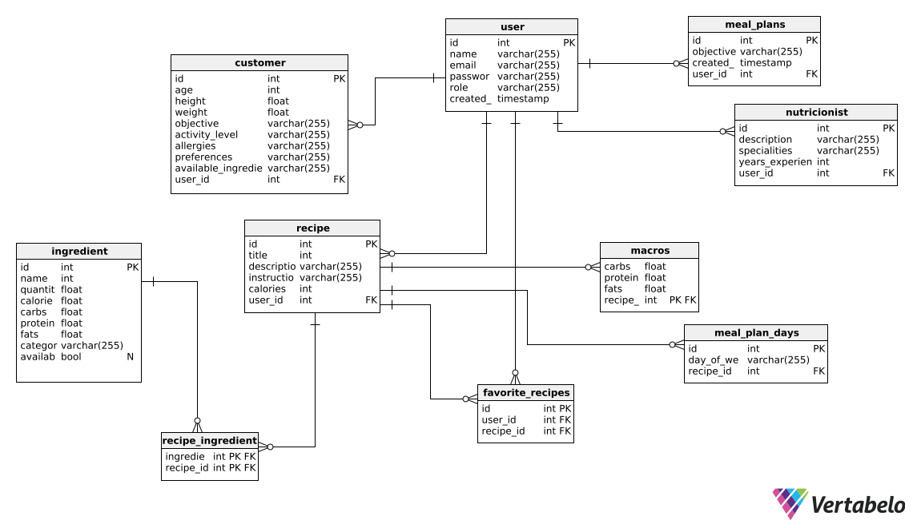
</p>

---
## Capítulo V: Product Implementation, Validation & Deployment

### 5.1. Software Configuration Management.
Este apartado detalla la configuración del entorno de desarrollo, la gestión del código fuente, las convenciones de estilo y el proceso de despliegue del sistema web de planificación de comidas inteligentes y personalizadas.
#### 5.1.1. Software Development Environment Configuration.
**Diseño UX/UI**
En esta sección nos centramos en la creación de interfaces atractivas e intuitivas, considerando las necesidades y preferencias de los usuarios. Las herramientas empleadas son:
- **Figma**: Permite diseñar y compartir interfaces de usuario de manera colaborativa y eficiente.

<p align="center">
  
</p>

**Desarrollo de Software**
Para el proceso de creación y programación del software, utilizamos las siguientes herramientas y tecnologías:

- **IDE para Backend**: Se utilizó IntelliJ IDEA como entorno de desarrollo principal para el backend desarrollado en Java con el framework Spring Boot. Esta herramienta ofrece integración avanzada con Maven/Gradle, control de versiones Git, ejecución de pruebas, autocompletado inteligente y soporte para múltiples frameworks y servicios web.

<p align="center">
  
</p>

- **IDE para Frontend**: Para el desarrollo frontend en Angular, se utilizó WebStorm, un IDE especializado de JetBrains que facilita el trabajo con TypeScript, HTML y Tailwind CSS. WebStorm proporciona inspecciones de código, refactorizaciones, vista previa en vivo, y soporte completo para proyectos en Angular.

<p align="center">
  
</p>

- **Github**: Plataforma para alojar el repositorio del proyecto y gestionar el control de versiones del código fuente y la documentación, facilitando la colaboración y el seguimiento de cambios.

<p align="center">
  
</p>

**Desarrollo de Software**
- **Markdown**: Plataforma para alojar el repositorio del proyecto y gestionar el control de versiones del código fuente y la documentación, facilitando la colaboración y el seguimiento de cambios.

<p align="center">
  
</p>

- **LucidChart**: Programa para crear diagramas UML y diagramas de flujo, ayudando a representar visualmente la arquitectura y los procesos del proyecto.

<p align="center">
  
</p>


#### 5.1.2. Source Code Management
El proyecto utiliza Git como sistema de control de versiones distribuido. Para asegurar una gestión eficiente del código fuente, se aplicó la estrategia de ramas conocida como Git Flow, que facilita la colaboración entre desarrolladores, la integración de nuevas funcionalidades y el mantenimiento del código en producción.

| Producto              | Repositorio            | URL                                                                 |
|-----------------------|------------------------|----------------------------------------------------------------------|
| Repositorio de Informe          | github    |[https://github.com/BiteWise-Grupo-OpenSource/Startup-Docs](https://github.com/BiteWise-Grupo-OpenSource/Startup-Docs)   
| Landing Page          | github    |[https://github.com/BiteWise-Grupo-OpenSource/landing-page.git](https://github.com/BiteWise-Grupo-OpenSource/landing-page.git) 
                                        


**Implementación de Git Flow**

Se definieron las siguientes ramas principales:
- **main**: rama principal que contiene las versiones estables.
- **develop**: rama donde se integran todas las funcionalidades antes de pasar a producción.
- **feature/***: ramas individuales para el desarrollo de nuevas funcionalidades.
- **release/***: ramas para la preparación de nuevas versiones.
- **hotfix/***: ramas para corregir errores críticos directamente en producción.

**Flujo de Trabajo en Git Flow**

1.	Crear una rama feature/nueva-funcionalidad desde develop.
2.	Realizar el desarrollo y pruebas en la rama feature.
3.	Fusionar la rama feature con develop una vez completada.
4.	Preparar la versión final en una rama release.
5.	Fusionar release con main y develop.
6.	Crear una etiqueta (tag) con la versión liberada.
7.	En caso de errores críticos, crear una hotfix desde main y seguir el flujo correspondiente.

**Convenciones de Commits**

Para mantener un historial de cambios limpio y comprensible, se adoptó una convención de mensajes de commit inspirada en Conventional Commits. Esta convención facilita la automatización en el versionado, el análisis de cambios y el seguimiento del desarrollo.

**Estructura del mensaje**

< tipo >(componente): descripción corta en minúsculas y en infinitivo

**Tipos de Commits permitidos**

| Tipo       | Uso recomendado| 
|------------|----------------|
| *feat*     | Nueva funcionalidad para el sistema  |
| *fix*      | Corrección de errores o bugs  |
| *docs*     | Cambios en la documentación (README, comentarios, etc.)   |
| *style*    | Cambios de formato (espacios, comas, punto y coma, etc.) sin afectar la lógica del código  |
| *refactor* | Refactorización del código sin cambios funcionales ni correcciones  |
| *test*     | Agregado o modificación de pruebas (unitarias, integradas, etc.)   |
| *chore*    | Tareas menores que no afectan la lógica (actualización de dependencias, archivos de configuración, etc.)   |
| *build*    | Cambios relacionados al sistema de construcción, CI/CD o entorno de despliegue   |
| *perf*     |Cambios orientados a mejorar el rendimiento del sistema   |

**Ejemplos de commits**

- **feat(auth)**: agregar funcionalidad de inicio de sesión con JWT
- **fix(api)**: corregir error 500 al enviar datos nulos desde el formulario
- **docs(readme)**: actualizar sección de instalación
- **style(navbar)**: aplicar espaciado correcto entre íconos
- **refactor(recipe)**: simplificar lógica de filtrado de ingredientes
- **test(user)**: agregar pruebas unitarias al componente de registro
- **chore(deps)**: actualizar dependencias npm
- **build(deploy)**: configurar script para despliegue automático en GitHub Pages
  
#### 5.1.3. Source Code Style Guide & Conventions

Este apartado establece las guías y convenciones adoptadas para el desarrollo de la solución, con el objetivo de asegurar un código consistente, legible, mantenible y alineado con las buenas prácticas de la industria del software. Se aplicarán convenciones estándar ampliamente reconocidas para cada uno de los lenguajes utilizados en el proyecto: HTML, CSS, JavaScript, TypeScript y Java.

Todas las nomenclaturas, identificadores y estructuras utilizadas en el código estarán escritas en inglés.

#### Referencias adoptadas

Las siguientes guías y convenciones servirán como referencia principal durante el desarrollo:

- [Angular Style Guide (oficial)](https://angular.io/guide/styleguide)
- [Google TypeScript Style Guide](https://google.github.io/styleguide/tsguide.html)
- [Google Java Style Guide](https://google.github.io/styleguide/javaguide.html)
- [Google HTML/CSS Style Guide](https://google.github.io/styleguide/htmlcssguide.html)
- [HTML Style Guide and Coding Conventions - W3Schools](https://www.w3schools.com/html/html5_syntax.asp)
- [Spring Boot Features](https://docs.spring.io/spring-boot/docs/current/reference/htmlsingle/)

#### Organización del código

El proyecto se estructurará en función de responsabilidades y funcionalidades, separando componentes, servicios, modelos, vistas, rutas y configuraciones. Esta organización facilita la escalabilidad del sistema y promueve la reutilización de código, manteniendo una separación clara de responsabilidades (*Separation of Concerns*).

#### Convenciones de nomenclatura

| Elemento                      | Convención Adoptada                        | Ejemplo                          |
|------------------------------|--------------------------------------------|----------------------------------|
| Componentes de Angular       | PascalCase + sufijo `Component`            | `UserProfileComponent`           |
| Servicios de Angular         | PascalCase + sufijo `Service`              | `AuthService`                    |
| Interfaces (TypeScript)      | PascalCase                                 | `User`, `CourseDetails`          |
| Archivos TS/HTML/CSS         | kebab-case con sufijos correspondientes    | `user-profile.component.ts`      |
| Variables / funciones (TS)   | camelCase                                  | `getUserData()`                  |
| Constantes (TS)              | UPPER_SNAKE_CASE                           | `MAX_LOGIN_ATTEMPTS`             |
| Clases (Java)                | PascalCase                                 | `UserController`                 |
| Métodos y variables (Java)   | camelCase                                  | `getUserById()`                  |
| Paquetes Java                | lowercase con puntos                       | `com.example.project.module`     |

#### Convenciones por lenguaje

###### TypeScript

- Tipado estricto y explícito en todas las declaraciones.
- Uso obligatorio de `let` y `const`; se evita `var`.
- No se permite lógica compleja en componentes; esta debe delegarse a servicios.
- Importaciones organizadas en el siguiente orden: Angular, librerías de terceros, módulos internos.
- Se evita el uso del prefijo `I` para interfaces.

###### JavaScript

- Se sigue el estándar definido por ESLint y Prettier.
- Uso de funciones puras y modularidad.
- Variables y funciones nombradas en camelCase.
- Promoción del uso de `const` y `let`.

###### HTML

- Todas las etiquetas y atributos deben escribirse en minúsculas.
- Se emplea indentación de 2 espacios por nivel.
- Los atributos deben estar entre comillas dobles.
- Se favorece la semántica y accesibilidad del contenido, siguiendo las pautas del estándar HTML5.

###### CSS / SCSS

- Se utiliza la metodología BEM (Block Element Modifier) para la definición de clases.

```css
.button {}
.button--primary {}
.button__icon {}
```

- Estructura modular de estilos, agrupados por componente.

- Uso de variables SCSS para colores, fuentes y tamaños.

- Están prohibidos los estilos en línea y el uso indiscriminado de !important.

###### JAVA
- Organización por capas: controller, service, repository, model, etc.

- Uso de anotaciones estándar como `@RestController`, `@Service`, `@Repository`.

- Documentación con Javadoc en clases y métodos públicos.

- Acceso a atributos mediante métodos getter y setter.

- Se sigue el https://google.github.io/styleguide/javaguide.html

##### Internacionalización

Se utiliza el paquete `@ngx-translate/core` para la internacionalización de la interfaz.

Toda cadena visible al usuario se encuentra externalizada en archivos JSON, organizados por idioma.

Las claves de traducción están en mayúsculas y separadas por puntos para reflejar su estructura jerárquica.

```css
<h1>{{ 'LOGIN.TITLE' | translate }}</h1>
```

---

#### 5.1.4. Software Deployment Configuration

El proceso de despliegue se diseñó considerando la arquitectura del sistema, el uso de Angular para el frontend y Spring Boot para el backend, así como la integración con el control de versiones mediante GitHub.

Se configuró un entorno de producción optimizado, utilizando variables de entorno para la gestión de parámetros sensibles como endpoints de APIs y configuraciones del sistema. Asimismo, se generaron builds optimizados para mejorar el rendimiento de la aplicación.

Para el frontend, se realizó la compilación del proyecto Angular en modo producción, generando archivos estáticos optimizados (HTML, CSS y JavaScript), los cuales fueron desplegados en un servicio de hosting web que permite el acceso público a la aplicación.

En el caso del backend, la aplicación desarrollada con Spring Boot fue empaquetada como un archivo ejecutable (.jar) y desplegada en un servidor, permitiendo la exposición de servicios mediante APIs REST. Se configuraron aspectos como puertos de ejecución y conexión a la base de datos.

El despliegue se encuentra vinculado al repositorio en GitHub, donde cada versión estable del sistema se asocia a la rama main y se identifican mediante etiquetas (tags). Adicionalmente, se consideró la integración de herramientas de automatización como GitHub Actions para facilitar procesos de integración y despliegue continuo.

Finalmente, se garantizaron aspectos de seguridad y accesibilidad mediante el uso de HTTPS y la correcta configuración de la comunicación entre frontend y backend.

---

## 5.2. Landing Page, Services & Applications Implementation

**Creación de landing page:**

1. Se crea un repositorio remoto en GitHub  
2. Se agregan los participantes del equipo  
3. Se habilita GitHub Pages en la branch "main"  
4. Se desarrolla el landing page utilizando Angular y TypeScript  

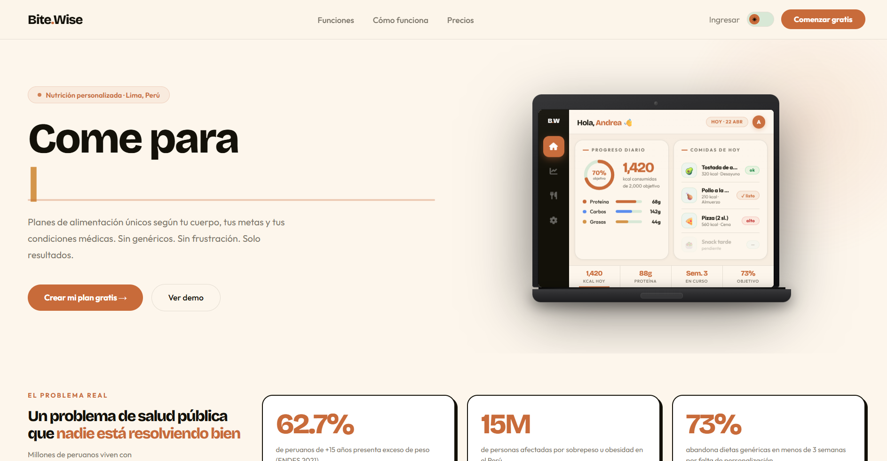

**Enlace de Figma:**  
https://www.figma.com/design/D0LIGgnXqpX8ty6fc4NyWC/BiteWise  

**Enlace del Landing Page:**  
https://bitewise-grupo-opensource.github.io/bitewise-landing/

---

## 5.2.1. Sprint 1

El Sprint 1 se centró en el desarrollo del landing page de BiteWise, aplicando la metodología Scrum.

Se organizaron reuniones para planificar tareas, distribuir responsabilidades y avanzar en la implementación de una interfaz funcional, intuitiva y alineada a la propuesta de valor del proyecto.

---

## 5.2.1.1. Sprint Planning 1

**Sprint:** Implementación del Landing Page  

- **Fecha:** 10/04/2025  
- **Hora:** 20:00  
- **Lugar:** Discord  

**Objetivo del Sprint:**

Desarrollar y desplegar el landing page de BiteWise.

**Sprint Velocity:** 35  
**Story Points:** 30  

---

## 5.2.1.2. Aspect Leaders and Collaborators

Durante el Sprint 1, el equipo se organizó asignando responsabilidades según habilidades:

- **Frontend (Angular):** desarrollo de componentes  
- **Diseño UI/UX:** implementación basada en Figma  
- **Integración:** ensamblaje de componentes  
- **Control de versiones:** gestión del repositorio GitHub  

Todos los integrantes participaron de forma colaborativa en el desarrollo.

---

## 5.2.1.3. Sprint Backlog 1

| Id   | Componente         | Description                              | Estimación (Horas) | Status |
|------|------------------|------------------------------------------|--------------------|--------|
| BW01 | Navbar           | Barra de navegación                      | 3                  | Done   |
| BW02 | Hero             | Sección principal                        | 3                  | Done   |
| BW03 | Stats            | Métricas visuales                        | 2                  | Done   |
| BW04 | Problem          | Problema del usuario                     | 2                  | Done   |
| BW05 | Features         | Funcionalidades                          | 3                  | Done   |
| BW06 | How              | Funcionamiento del sistema               | 2                  | Done   |
| BW07 | Pricing          | Planes                                  | 2                  | Done   |
| BW08 | Dashboard Preview| Vista previa                            | 3                  | Done   |
| BW09 | CTA Footer       | Llamado a la acción                      | 2                  | Done   |

---

## 5.2.1.4. Development Evidence for Sprint Review

| Repository        | Branch             | Commit Message                | Date       |
|------------------|-------------------|------------------------------|------------|
| BiteWise-Landing | feature/start     | feat: initial setup          | 27/04/2025 |
| BiteWise-Landing | feature/components| feat: add components         | 27/04/2025 |
| BiteWise-Landing | feature/styles    | feat: responsive design      | 27/04/2025 |
| BiteWise-Landing | feature/ui        | feat: UI improvements        | 27/04/2025 |

---

## 5.2.1.5. Execution Evidence for Sprint Review

**Enlace del sistema desplegado:**  
https://bitewise-grupo-opensource.github.io/landing-page/

---

#### 5.2.1. Sprint 1
##### 5.2.1.1. Sprint Planning 1

En esta sección se describen los aspectos principales del Sprint Planning Meeting correspondiente al Sprint 1 del proyecto BiteWise. Durante esta reunión, el equipo definió los objetivos del sprint, revisó el contexto inicial del proyecto y estableció las historias de usuario que serán abordadas. Asimismo, se acordaron lineamientos de trabajo colaborativo y la distribución inicial de responsabilidades para asegurar el cumplimiento de los objetivos planteados.

<table>
  <tr>
    <td><b>Sprint #</b></td>
    <td>Sprint 1</td>
  </tr>

  <tr>
    <td colspan="2"><b>Sprint Planning Background</b></td>
  </tr>
  <tr>
    <td>Date</td>
    <td>2026-04-14</td>
  </tr>
  <tr>
    <td>Time</td>
    <td>07:00 PM</td>
  </tr>
  <tr>
    <td>Location</td>
    <td>Reunión virtual vía Google Meet</td>
  </tr>
  <tr>
    <td>Prepared By</td>
    <td>Munayco Apolaya, Maria Luisa</td>
  </tr>
  <tr>
    <td>Attendees (to planning meeting)</td>
    <td>Hermoza Quispe, Jude Alessandro / Flores Siguas, Marlon Alessandro / Munayco Apolaya, Maria Luisa / Verastigue Martinez, Giancarlo Jose / Mantilla, Enrique</td>
  </tr>

  <tr>
    <td><b>Sprint n – 1 Review Summary</b></td>
    <td>Al ser el primer sprint del proyecto, no se cuenta con un sprint previo. Sin embargo, el equipo definió la propuesta de valor de BiteWise, enfocada en la generación de planes de alimentación personalizados según preferencias, objetivos de salud y restricciones nutricionales.</td>
  </tr>

  <tr>
    <td><b>Sprint n – 1 Retrospective Summary</b></td>
    <td>No aplica para el primer sprint. El equipo acordó establecer una comunicación constante, definir roles claros y organizar el trabajo de manera colaborativa para asegurar el cumplimiento de los objetivos del proyecto.</td>
  </tr>

  <tr>
    <td colspan="2"><b>Sprint Goal & User Stories</b></td>
  </tr>
  <tr>
    <td>Sprint 1 Goal</td>
    <td>Nuestro enfoque es desarrollar la estructura inicial de la plataforma BiteWise e implementar las funcionalidades básicas de registro de usuario y recopilación de preferencias alimenticias. Creemos que esto proporciona un punto de partida personalizado para que los usuarios puedan recibir planes de alimentación adaptados a sus necesidades. Esto se confirmará cuando los usuarios puedan registrarse, ingresar sus preferencias y visualizar un plan de comidas personalizado inicial.</td>
  </tr>
  <tr>
    <td>Sprint 1 Velocity</td>
    <td>20 Story Points</td>
  </tr>
  <tr>
    <td>Sum of Story Points</td>
    <td>18 Story Points</td>
  </tr>
</table>


---

##### 5.2.1.2. Aspect Leaders and Collaborators

En esta sección se presenta la matriz de liderazgo y colaboración (LACX) correspondiente al Sprint 1 del proyecto BiteWise. Para este sprint, el equipo ha definido como principales aspectos el desarrollo de la estructura base del sistema, la gestión de usuarios, la recopilación de preferencias alimenticias y el diseño de la interfaz de usuario.

Cada aspecto cuenta con un líder responsable y colaboradores que apoyan en su desarrollo, con el fin de mejorar la organización del equipo, facilitar la comunicación y asegurar el cumplimiento de los objetivos del sprint.

| Team Member (Last Name, First Name) | GitHub Username | Estructura Base del Sistema<br>Leader (L) / Collaborator (C) | Gestión de Usuarios<br>Leader (L) / Collaborator (C) | Preferencias Alimenticias<br>Leader (L) / Collaborator (C) | Diseño UI<br>Leader (L) / Collaborator (C) |
|------------------------------------|-----------------|--------------------------------|---------------------|----------------------------|-----------|
| Hermoza Quispe, Jude Alessandro | JvnnDev | L | C | C | C |
| Flores Siguas, Marlon Alessandro | MarlonFS965 | C | L | C | C |
| Munayco Apolaya, Maria Luisa | malumunayco | C | C | L | C |
| Verastigue Martinez, Giancarlo Jose | CaLoVM | C | C | C | L |
| Mantilla, Enrique | enrique-mantilla | C | C | C | C |

---

##### 5.2.1.3. Sprint Backlog 1

<p>
En esta sección se presenta el Sprint Backlog correspondiente al Sprint 1 del proyecto BiteWise. El objetivo principal de este sprint es el desarrollo inicial de la Landing Page, enfocándonos en la propuesta de valor y la presentación de los beneficios principales para los visitantes.
</p>

<table border="1">
  <tr>
    <td><b>Sprint #</b></td>
    <td colspan="7">Sprint 1</td>
  </tr>

  <tr>
    <td colspan="2"><b>User Story</b></td>
    <td colspan="6"><b>Work-Item / Task</b></td>
  </tr>

  <tr>
    <td><b>Id</b></td>
    <td><b>Title</b></td>
    <td><b>Id</b></td>
    <td><b>Title</b></td>
    <td><b>Description</b></td>
    <td><b>Estimation (Hours)</b></td>
    <td><b>Assigned To</b></td>
    <td><b>Status</b></td>
  </tr>

  <tr>
    <td>US-10</td>
    <td>Conocer la propuesta de valor</td>
    <td>T01</td>
    <td>Diseñar Hero Section</td>
    <td>Crear el diseño visual de la sección principal (Hero)</td>
    <td>4</td>
    <td>Maria Munayco</td>
    <td>Done</td>
  </tr>

  <tr>
    <td>US-10</td>
    <td>Conocer la propuesta de valor</td>
    <td>T02</td>
    <td>Maquetar Hero Section</td>
    <td>Desarrollar la sección Hero en el Frontend con HTML/CSS</td>
    <td>5</td>
    <td>Giancarlo Verastigue</td>
    <td>Done</td>
  </tr>

  <tr>
    <td>US-06</td>
    <td>Ver resumen de beneficios</td>
    <td>T03</td>
    <td>Diseñar sección de beneficios</td>
    <td>Crear diseño visual de las tarjetas de beneficios de la app</td>
    <td>4</td>
    <td>Jude Hermoza</td>
    <td>Done</td>
  </tr>

  <tr>
    <td>US-11</td>
    <td>Navegar por los beneficios principales</td>
    <td>T04</td>
    <td>Maquetar beneficios</td>
    <td>Implementar la sección de beneficios en el Frontend</td>
    <td>4</td>
    <td>Enrique Mantilla</td>
    <td>Done</td>
  </tr>

  <tr>
    <td>US-09</td>
    <td>Acceder desde distintos dispositivos</td>
    <td>T05</td>
    <td>Ajustes Responsive</td>
    <td>Asegurar que la Landing Page sea responsive en móvil y tablet</td>
    <td>6</td>
    <td>Giancarlo Verastigue</td>
    <td>Done</td>
  </tr>

</table>

---

##### 5.2.1.4. Development Evidence for Sprint Review

En esta sección se presentan los avances de implementación alcanzados durante el Sprint 1 del proyecto BiteWise. Durante este sprint, el equipo trabajó de manera colaborativa utilizando GitHub para la gestión del código y control de versiones, organizando el trabajo mediante el uso de ramas por integrante.

| Repository | Branch | Commit Id | Commit Message | Commit Message Body | Commited on (Date) |
|------------|--------|-----------|----------------|---------------------|--------------------|
| BiteWise | feature/Munayco | f1a2b3c | feat: diseño hero section | Diseño de la sección principal para propuesta de valor | 2026-04-20 |
| BiteWise | feature/Verastigue | d4e5f6g | feat: maquetado hero | Desarrollo Frontend HTML/CSS de la hero section | 2026-04-21 |
| BiteWise | feature/Hermoza | h7i8j9k | feat: diseño beneficios | Diseño visual de tarjetas de beneficios | 2026-04-22 |
| BiteWise | feature/Mantilla | v1s2t3u | feat: maquetado beneficios | Implementación frontend sección beneficios | 2026-04-22 |
| BiteWise | develop | z9x8c7v | feat: ajustes responsive | Adaptación a móviles de la landing page | 2026-04-23 |
| BiteWise | develop | m4n5b6v | docs: avance documentación | Desarrollo de capítulos del informe y organización del sprint | 2026-04-23 |

---

##### 5.2.1.5. Execution Evidence for Sprint Review

Como resultado de este sprint, se logró completar la estructura visual y funcional de la landing page de BiteWise. A continuación, se presentan capturas de pantalla de cada una de las secciones implementadas, las cuales fueron desarrolladas con un enfoque responsivo y coherente con la identidad visual del proyecto:

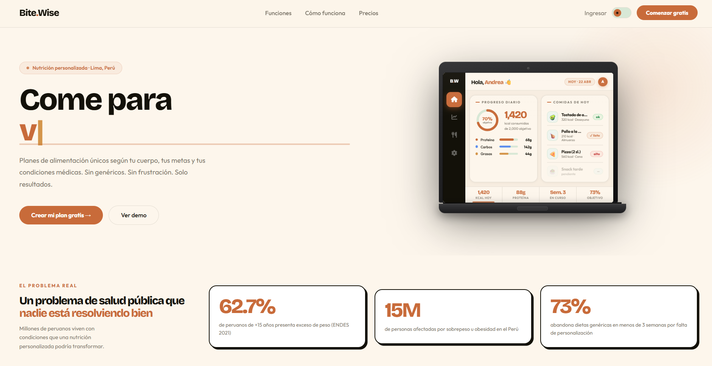
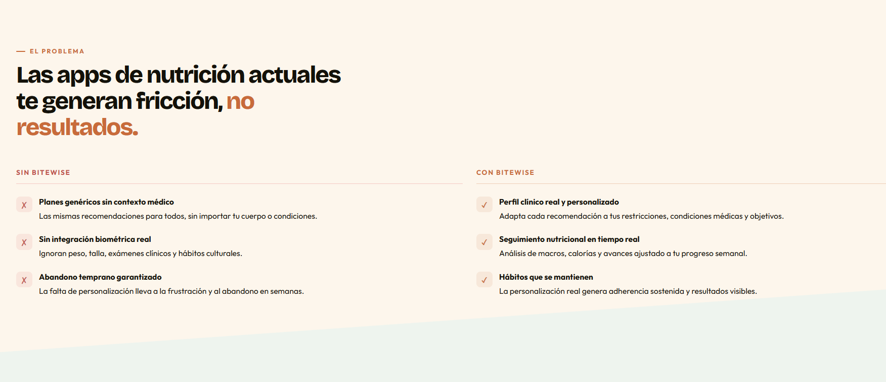
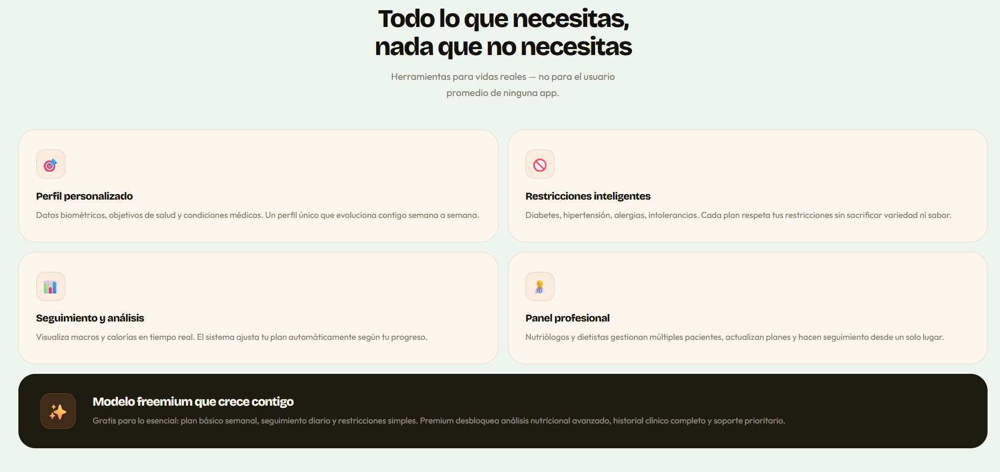
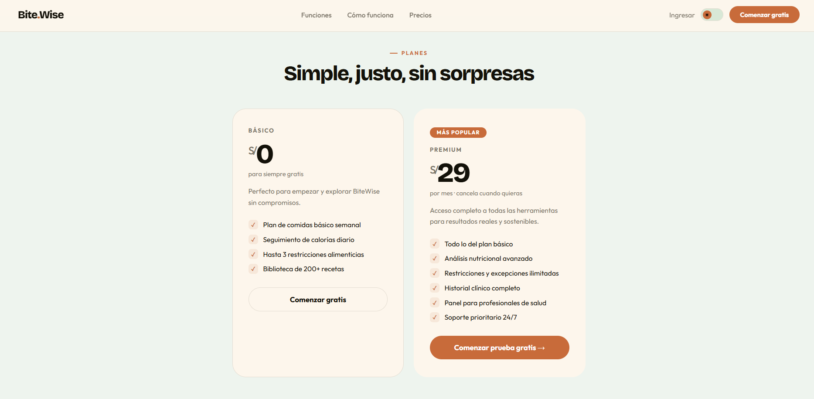

### Video demostrativo

A continuación, se presenta un video donde se muestra la lading page elaborada en este sprint.
**Link del video:** 

---

##### 5.2.1.6. Services Documentation Evidence for Sprint Review

Debido a que el proyecto se encuentra en una etapa inicial enfocada exclusivamente en el desarrollo de la **Landing Page** para validación del modelo de negocio, aún no se cuenta con una documentación de servicios, APIs o endpoints. 

El desarrollo de la lógica de negocio (Backend), autenticación y gestión de usuarios se abordará en Sprints posteriores, momento en el cual se incluirá la documentación correspondiente utilizando OpenAPI o similares.


  
---

##### 5.2.1.7. Software Deployment Evidence for Sprint Review

En esta sección se presentan las actividades realizadas relacionadas con el despliegue (deployment) durante el Sprint 1 del proyecto BiteWise. En esta etapa inicial, el equipo se enfocó en la preparación del entorno de desarrollo y la organización del repositorio, con el objetivo de facilitar futuros procesos de despliegue.

Durante este Sprint, se realizaron las siguientes actividades:

- Creación y configuración del repositorio del proyecto en GitHub.  
- Definición de ramas de trabajo (feature branches y rama develop) para organizar el desarrollo colaborativo.  
- Configuración inicial del proyecto para permitir su futura integración y despliegue.  
- Estructuración del proyecto de manera que permita una posterior implementación en plataformas de despliegue como servicios cloud.

Estas acciones permiten establecer una base sólida para la automatización y despliegue continuo en los siguientes Sprints.

### Evidencia de Deployment

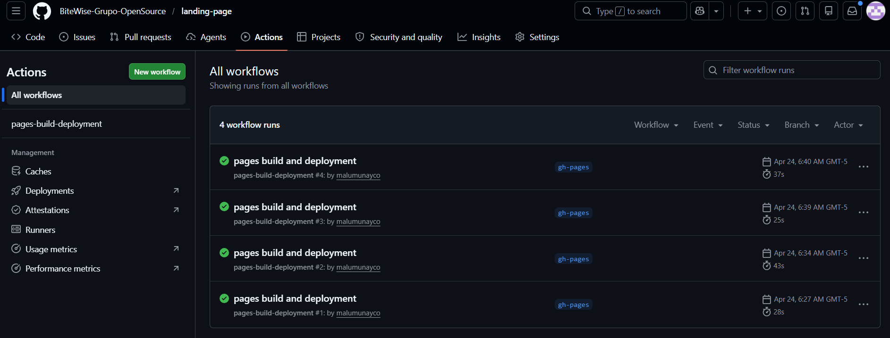


##### 5.2.1.8. Team Collaboration Insights during Sprint


Durante el Sprint 1, el equipo desarrolló las actividades de implementación de manera colaborativa, organizando el trabajo tanto a nivel de desarrollo del producto como de documentación. Se empleó GitHub como herramienta principal para el control de versiones, permitiendo que cada integrante contribuya mediante commits y trabajo en ramas independientes.

Cada miembro del equipo participó activamente en el desarrollo del proyecto, trabajando en funcionalidades específicas y en la elaboración de distintas secciones del documento. Esta distribución permitió avanzar de forma paralela y eficiente.

En cuanto al desarrollo técnico, se utilizaron ramas por integrante (feature branches), tales como:

- feature/Flores  
- feature/Mantilla  
- feature/Verastigue  
- feature/Hermoza  
- feature/Munayco  
- develop  

Esto permitió mantener un flujo de trabajo ordenado, donde cada integrante desarrolló sus funcionalidades de forma independiente antes de integrarlas en la rama principal.

Asimismo, se evidencia la participación de todos los miembros mediante commits realizados en el repositorio, contribuyendo al desarrollo de las funcionalidades iniciales como registro de usuarios, login, interfaz inicial y estructura del sistema.

En relación con los productos del Sprint:
- **Landing Page:** Se desarrollaron componentes visuales iniciales.  
- **Web Application:** Se implementaron funcionalidades básicas como registro y login.  
- **Web Services:** Se definieron los endpoints iniciales para futuras implementaciones.  

#### 5.2.2. Sprint 2
##### 5.2.2.1. Sprint Planning 2.

En esta sección se describen los aspectos principales del Sprint Planning Meeting correspondiente al Sprint 2 del proyecto BiteWise. Durante esta reunión, el equipo definió los objetivos del sprint, los cuales serán la elaboración del frontend y los bounded context

<table>
  <tr>
    <td><b>Sprint #</b></td>
    <td>Sprint 2</td>
  </tr>

  <tr>
    <td colspan="2"><b>Sprint Planning Background</b></td>
  </tr>
  <tr>
    <td>Date</td>
    <td>2026-05-09</td>
  </tr>
  <tr>
    <td>Time</td>
    <td>04:00 PM</td>
  </tr>
  <tr>
    <td>Location</td>
    <td>Reunión virtual vía Google Meet</td>
  </tr>
  <tr>
    <td>Prepared By</td>
    <td>Mantilla Maldonado, Enrique Manuel</td>
  </tr>
  <tr>
    <td>Attendees (to planning meeting)</td>
    <td>Hermoza Quispe, Jude Alessandro / Munayco Apolaya, Maria Luisa / Verastigue Martinez, Giancarlo Jose / Mantilla Maldonado, Enrique Manuel</td>
  </tr>

  <tr>
    <td><b>Sprint n – 2 Review Summary</b></td>
    <td>Se arreglaron algunos problemas y detalles señalados por el profesor. Además se desarrollo la primera version de la landing page</td>
  </tr>

  <tr>
    <td><b>Sprint n – 1 Retrospective Summary</b></td>
    <td>El progreso del proyecto está avanzando como se esperaba, aunque tambien tiene sus detalles por revisar. Hasta ahora se ha desarrollado la landing page pero falta agregarle algunos retoques.</td>
  </tr>

  <tr>
    <td colspan="2"><b>Sprint Goal & User Stories</b></td>
  </tr>
  <tr>
    <td>Sprint 1 Goal</td>
    <td>Nuestro objetivos en este sprint seria mejorar la landing page tomando en cuenta la retroalimentación del profesor. Además, avanzaremos con la primera versión del Front End de nuestro proyecto mediante el uso de CRUDS. Esto nos permitirá presentar las funcionalidades de nuestra propuesta.</td>
  </tr>
  <tr>
    <td>Sprint 1 Velocity</td>
    <td>Se calcula que se podrá desarrollar 30 Story Points</td>
  </tr>
  <tr>
    <td>Sum of Story Points</td>
    <td>Se completaron los 30 Story Points</td>
  </tr>
</table>


##### 5.2.2.2. Aspect Leaders and Collaborators.

En este sprint, el equipo busca desarrollar y desplegar el frontend de la aplicación web. Además, se desarrollará una fakeAPI para simular temporalmente el backend. Los puntos que se buscan desarrollar seria el desarrollo de los componentes del front end, el despliegue del front end e integracion de la fakeAPI

Cada aspecto cuenta con un líder responsable y colaboradores que apoyan en su desarrollo, con el fin de mejorar la organización del equipo, facilitar la comunicación y asegurar el cumplimiento de los objetivos del sprint.

| Team Member (Last Name, First Name) | GitHub Username | Frontend Desarrollo de componentes <br>Leader (L) / Collaborator (C) | Despliegue del Front End<br>Leader (L) / Collaborator (C) | Desarrollo e Implementación de la fakeAPI<br>Leader (L) / Collaborator (C) |  |
|------------------------------------|-----------------|--------------------------------|---------------------|----------------------------|-----------|
| Hermoza Quispe, Jude Alessandro | JvnnDev | L | C | C |
| Munayco Apolaya, Maria Luisa | malumunayco | C | C | C |
| Verastigue Martinez, Giancarlo Jose | CaLoVM | C | L | C |
| Mantilla Maldonado, Enrique Manuel | enrique-mantilla | C | C | L |

##### 5.2.2.3. Sprint Backlog 2.

El siguiente Sprint Backlog detalla las historias de usuario y sus respectivas tareas para el Sprint 2, el cual está orientado a completar y mejorar la Landing Page según el feedback recibido, integrando un sistema de navegación optimizado, testimonios e internacionalización.

<table border="1">
  <tr>
    <td><b>Sprint #</b></td>
    <td colspan="7">Sprint 2</td>
  </tr>

  <tr>
    <td colspan="2"><b>User Story</b></td>
    <td colspan="6"><b>Work-Item / Task</b></td>
  </tr>

  <tr>
    <td><b>Id</b></td>
    <td><b>Title</b></td>
    <td><b>Id</b></td>
    <td><b>Title</b></td>
    <td><b>Description</b></td>
    <td><b>Estimation (Hours)</b></td>
    <td><b>Assigned To</b></td>
    <td><b>Status</b></td>
  </tr>

  <tr>
    <td>US-12</td>
    <td>Navegar entre secciones desde la barra</td>
    <td>T01</td>
    <td>Diseñar la barra de navegación</td>
    <td>Diseñar una barra superior (navbar) para viajar entre secciones</td>
    <td>1</td>
    <td>Enrique Mantilla</td>
    <td>Done</td>
  </tr>

  <tr>
    <td>US-12</td>
    <td>Navegar entre secciones desde la barra</td>
    <td>T02</td>
    <td>Implementar scroll a secciones</td>
    <td>Al clickear los nombres de la navbar redirigir a la sección</td>
    <td>2</td>
    <td>Giancarlo Verastigue</td>
    <td>Done</td>
  </tr>

  <tr>
    <td>US-14</td>
    <td>Navegar desde el footer</td>
    <td>T01</td>
    <td>Diseñar el footer de navegación</td>
    <td>Diseñar un pie de página con enlaces visibles hacia secciones</td>
    <td>1</td>
    <td>Jude Hermoza</td>
    <td>Done</td>
  </tr>

  <tr>
    <td>US-14</td>
    <td>Navegar desde el footer</td>
    <td>T02</td>
    <td>Implementar enlaces del footer</td>
    <td>Maquetar el footer y agregar redirecciones correspondientes</td>
    <td>2</td>
    <td>Enrique Mantilla</td>
    <td>Done</td>
  </tr>

  <tr>
    <td>US-08</td>
    <td>Visualizar testimonios</td>
    <td>T01</td>
    <td>Diseñar sección testimonios</td>
    <td>Crear diseño UI para comentarios de los usuarios</td>
    <td>2</td>
    <td>Maria Munayco</td>
    <td>Done</td>
  </tr>

  <tr>
    <td>US-08</td>
    <td>Visualizar testimonios</td>
    <td>T02</td>
    <td>Implementar testimonios</td>
    <td>Maquetar la sección de testimonios en el Frontend</td>
    <td>4</td>
    <td>Jude Hermoza</td>
    <td>Done</td>
  </tr>

  <tr>
    <td>US-56</td>
    <td>Intercambiar idiomas</td>
    <td>T01</td>
    <td>Integrar i18n</td>
    <td>Configurar internacionalización para español e inglés en Landing</td>
    <td>3</td>
    <td>Maria Munayco</td>
    <td>Done</td>
  </tr>

</table>


##### 5.2.2.4. Development Evidence for Sprint Review.

| Repository        | Branch             | Commit Message                | Date       |
|------------------|-------------------|------------------------------|------------|
| bitewise-front | feature/navbar    | feat: component navbar       | 10/05/2026 |
| bitewise-front | feature/footer    | feat: component footer       | 10/05/2026 |
| bitewise-front | feature/reviews   | feat: add testimonios slider | 11/05/2026 |
| bitewise-front | feature/i18n      | feat: translate landing page | 12/05/2026 |


##### 5.2.2.5. Execution Evidence for Sprint Review.

##### 5.2.2.6. Services Documentation Evidence for Sprint Review.

##### 5.2.2.7. Software Deployment Evidence for Sprint Review.

##### 5.2.2.8. Team Collaboration Insights during Sprint.


### Evidencia de colaboración

A continuación, se presentan capturas que evidencian el trabajo colaborativo del equipo:

- Historial de commits en GitHub  
- Creación de ramas por integrante  
- Actividad reciente del repositorio  


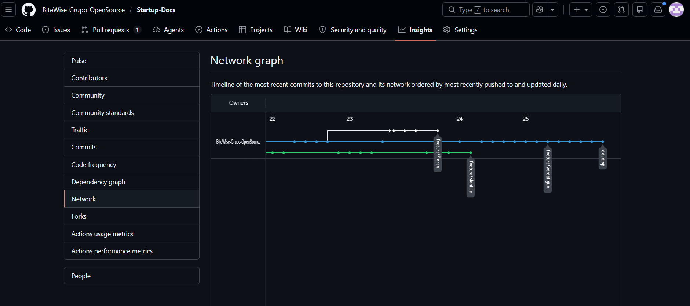
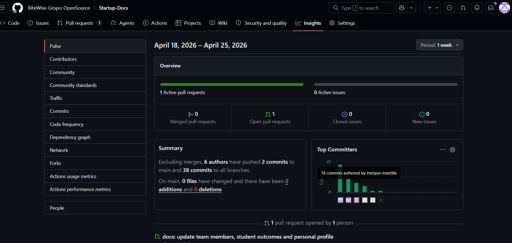

---

## Conclusiones

1. A partir del análisis realizado, se concluye que existe una problemática significativa en la personalización de planes alimenticios, ya que muchas soluciones actuales no consideran adecuadamente factores como condiciones médicas, preferencias culturales y contexto económico. Esto afecta directamente la adherencia de los usuarios a hábitos saludables, tal como se planteó en los *Problem Statements*.

2. En relación con los *assumptions*, se identificó que tanto los usuarios finales como los profesionales de la salud requieren herramientas digitales más eficientes, intuitivas y adaptadas a sus necesidades. La propuesta de BiteWise responde a esta necesidad mediante la generación de planes personalizados y el seguimiento continuo del usuario.

3. Respecto a las hipótesis planteadas, se concluye que la personalización, la posibilidad de editar planes, el uso de recordatorios y una experiencia de usuario sencilla tienen un alto potencial para mejorar el compromiso, la frecuencia de uso y la retención de los usuarios dentro de la plataforma.

4. Asimismo, el modelo freemium se presenta como una estrategia viable para atraer usuarios iniciales y evaluar su conversión a servicios premium, aunque este aspecto deberá validarse con datos reales en futuras etapas del proyecto.

5. Finalmente, se concluye que el equipo ha logrado establecer una base sólida del producto, definiendo correctamente los requerimientos, funcionalidades principales y un enfoque centrado en el usuario, alineado con la metodología Lean UX. No obstante, las hipótesis aún requieren validación mediante pruebas reales.

**Recomendaciones**

1. Se recomienda realizar validaciones con usuarios reales a través de prototipos o un MVP funcional, con el fin de comprobar las hipótesis planteadas y obtener retroalimentación directa.

2. Es importante implementar métricas de seguimiento, como la tasa de retención, frecuencia de uso y nivel de personalización, para medir el desempeño de la plataforma y tomar decisiones basadas en datos.

3. Se sugiere priorizar el desarrollo de las funcionalidades clave, como la generación de planes alimenticios personalizados, la edición de planes y la gestión de preferencias del usuario.

4. Se recomienda incorporar mecanismos de feedback continuo que permitan mejorar la experiencia del usuario de manera iterativa.

5. Asimismo, es importante evaluar la adopción de la plataforma por parte de profesionales de la salud, validando su utilidad en contextos reales.

6. Finalmente, se recomienda mantener un enfoque iterativo y centrado en el usuario, mejorando constantemente la interfaz y funcionalidades para asegurar que el producto genere valor real y sostenible en el mercado.

---

